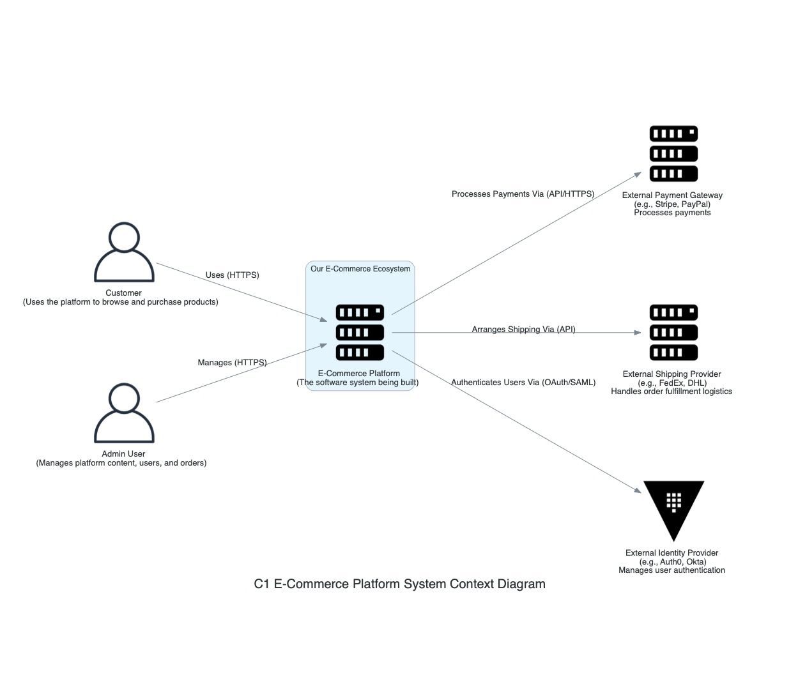

## C1: System Context Diagram - E-commerce Platform

This diagram outlines the scope of the E-commerce Platform, its key users, and its interactions with major external systems.

### System:

- **E-commerce Platform:** The core application responsible for all e-commerce functionalities.

### People:

- **Customer:** End-user browsing and purchasing products.
- **Administrator:** Internal user managing the platform's operations, catalog, orders, etc.

### External Software Systems:

- **Identity Provider (IdP):** Handles user authentication (login, registration) as per [ADR-028](./../adr/ADR-028-identity-and-access-management.md).
- **Payment Gateway:** Processes financial transactions for orders.
- **Shipping Provider API:** Provides logistics services like rate calculation, shipment booking, and tracking.
- **Email Service:** Sends transactional emails to users (e.g., order confirmations, password resets).

This diagram provides a high-level overview, setting the boundaries for more detailed diagrams to follow (like the C2 Container diagram).
