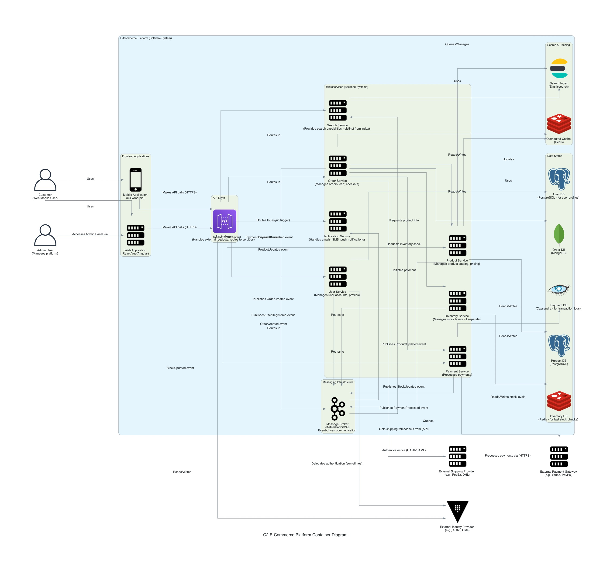

## C2: Container Diagram - E-commerce Platform

This diagram zooms into the "E-commerce Platform" system, showing its key containers (applications, data stores, etc.) and their primary interactions. It illustrates the high-level structure of the microservices architecture.

### People:

- **Customer:** Interacts with the `Customer Web App`.
- **Administrator:** Interacts with the `Admin Web App`.

### Containers within E-commerce Platform:

- **Frontend Tier:**
  - `Customer Web App` ([ADR-003](./../adr/ADR-003-nodejs-nestjs-for-initial-services.md) implies frontend tech may vary, but assumes SPA for now): Provides the user interface for customers.
  - `Admin Web App`: Provides the user interface for platform administrators.
- **API Gateway:** ([Implicitly required, standard component]): Single entry point for client requests. Handles routing, authentication ([ADR-028](./../adr/ADR-028-identity-and-access-management.md)), and other cross-cutting concerns.
- **Backend Microservices Tier** ([ADR-001](./../adr/ADR-001-adoption-of-microservices-architecture.md), [ADR-003](./../adr/ADR-003-nodejs-nestjs-for-initial-services.md)):
  - `User Service`: Manages user data.
  - `Product Service`: Manages product catalog (details, descriptions, categories, pricing etc.).
  - `Order Service`: Manages shopping carts, order processing.
  - `Payment Service`: Orchestrates payment processing with external gateways.
  - `Inventory Service`: Manages stock levels, reservations, and updates for products.
  - `Search Service`: Provides product search and filtering capabilities.
  - `Notification Service`: Handles sending emails and other notifications.
- **Data Stores Tier** ([ADR-004](./../adr/ADR-004-postgresql-for-relational-data.md)):
  - `User DB` (PostgreSQL): Stores user-specific data.
  - `Product DB` (PostgreSQL): Stores product catalog and inventory information.
  - `Order DB` (PostgreSQL): Stores order and cart data.
  - `Payment DB` (PostgreSQL): Stores payment transaction information.
- **Message Broker** ([ADR-018](./../adr/ADR-018-message-broker-strategy.md)):
  - `RabbitMQ`: Facilitates asynchronous communication between services (e.g., for events like 'OrderCreated').

### Interactions with External Systems:

- **Identity Provider (IdP):** Interacts primarily with the API Gateway (or directly with frontends/services during auth flows).
- **Payment Gateway:** Interacts with the `Payment Service`.
- **Shipping Provider API:** Interacts with the `Order Service` (or a future dedicated Shipping Service).
- **Email Service:** Interacts with the `Notification Service`.

This C2 diagram provides a clearer view of the major components and how they collaborate. The next level (C3) would zoom into one of these containers, like a specific microservice, to show its internal components.
