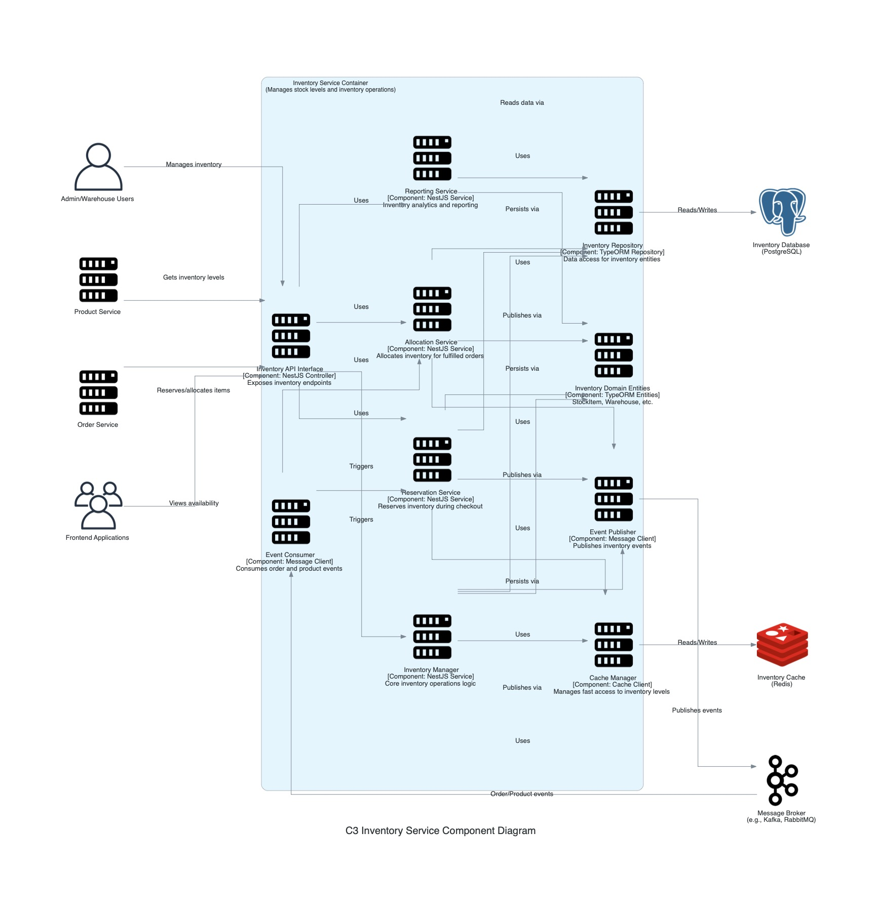

## C3: Component Diagram - Inventory Service

This diagram zooms into the `Inventory Service` container, showing its internal components and how they collaborate to manage stock levels and inventory operations. It also shows how the `Inventory Service` interacts with other containers and external systems from the C2 diagram's perspective.

### External Dependencies:
*   **Inventory Database:** PostgreSQL database storing inventory records, warehouse information, and allocation history.
*   **Inventory Cache:** Redis cache for fast access to current stock levels.
*   **Message Broker:** For publishing inventory events and consuming order/product events.

### External Users/Systems:
*   **Admin/Warehouse Users:** Manage inventory, conduct stock takes, and handle adjustments.
*   **Product Service:** Gets current inventory levels for product display.
*   **Order Service:** Reserves and allocates inventory during the order lifecycle.
*   **Frontend Applications:** Display product availability to customers.

### Internal Components:
*   **Inventory API Interface:** NestJS controllers exposing inventory endpoints.
*   **Inventory Manager:** Core service handling inventory operations and updates.
*   **Reservation Service:** Handles temporary inventory reservations during checkout.
*   **Allocation Service:** Manages permanent allocation of inventory to orders.
*   **Reporting Service:** Provides inventory analytics and reporting capabilities.
*   **Inventory Domain Entities:** TypeORM entities representing StockItem, Warehouse, etc.
*   **Inventory Repository:** TypeORM repository providing data access for inventory entities.
*   **Cache Manager:** Manages fast access to inventory levels via Redis.
*   **Event Publisher:** Publishes inventory-related events (e.g., `StockLevelChanged`, `ItemOutOfStock`).
*   **Event Consumer:** Consumes external events. For example, it listens for `OrderCreated` events to trigger the `Reservation Service`, and `OrderPaid` (or `ShipmentInitiated`) events to trigger the `Allocation Service`.

### Key Interactions:
*   Inventory levels are maintained by the Inventory Manager and persisted in the database via the `Inventory Repository`.
*   Critical stock levels are cached in Redis for high-performance availability checks, managed by the `Cache Manager`.
*   The Order Service interacts with the Reservation Service during checkout to temporarily hold inventory.
*   When orders are confirmed, the Allocation Service permanently allocates inventory to orders.
*   Admin users can manage inventory levels, locations, and transfers.
*   Stock level changes (e.g., after sales, stock receipts) trigger events published by the `Event Publisher` (e.g., `StockLevelChanged`) that other services can consume.
*   The system monitors low stock levels and can trigger reordering processes (potentially via an event).
*   The `Reporting Service` queries persisted inventory data via the `Inventory Repository` to provide insights into inventory performance and turnover.
*   Reporting capabilities provide insights into inventory performance and turnover.
