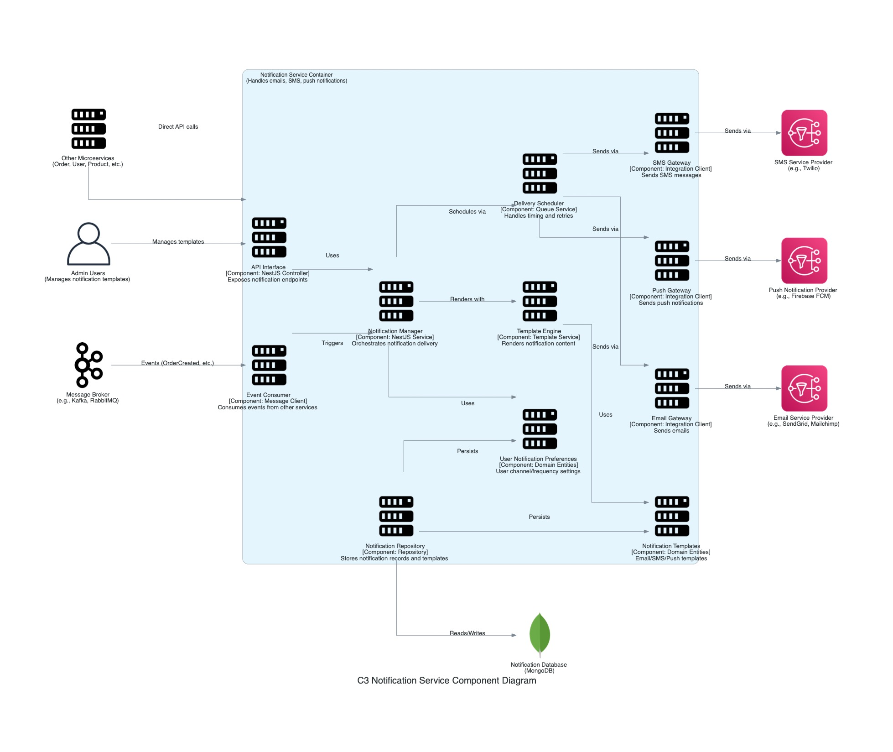

## C3: Component Diagram - Notification Service

This diagram zooms into the `Notification Service` container, showing its internal components and how they collaborate to handle various customer communications. It also shows how the `Notification Service` interacts with other containers and external systems from the C2 diagram's perspective.

### External Dependencies:
*   **Notification Database:** MongoDB database storing notification templates and delivery history.
*   **Message Broker:** Receives events from other services triggering notifications.
*   **Email Service Provider:** External service (e.g., SendGrid) for sending emails.
*   **SMS Service Provider:** External service (e.g., Twilio) for sending SMS messages.
*   **Push Notification Provider:** External service (e.g., Firebase FCM) for sending push notifications.

### External Users/Systems:
*   **Admin Users:** Configure notification templates and settings.
*   **Other Microservices:** Services that trigger notifications directly or via events.

### Internal Components:
*   **API Interface:** NestJS controllers exposing notification management endpoints.
*   **Notification Manager:** Orchestrates the notification delivery process.
*   **Template Engine:** Renders notification content using templates and data.
*   **Delivery Scheduler:** Handles timing of notifications and retries.
*   **Notification Templates:** Domain entities representing email/SMS/push templates.
*   **User Notification Preferences:** Domain entities for user communication preferences.
*   **Notification Repository:** Stores notification records and templates.
*   **Event Consumer:** Consumes events from the message broker.
*   **Email/SMS/Push Gateways:** Integration clients for various communication channels.

### Key Interactions:
*   The service primarily reacts to events from other services via the Event Consumer.
*   The Notification Manager decides which notifications to send based on the event and user preferences.
*   Templates are rendered with data from the triggering event.
*   The Delivery Scheduler manages timing and retry logic.
*   Notifications are sent via the appropriate gateway (Email, SMS, Push).
*   Admin users can configure templates and default preferences via the API.
*   All notification activity is recorded for compliance and troubleshooting.
