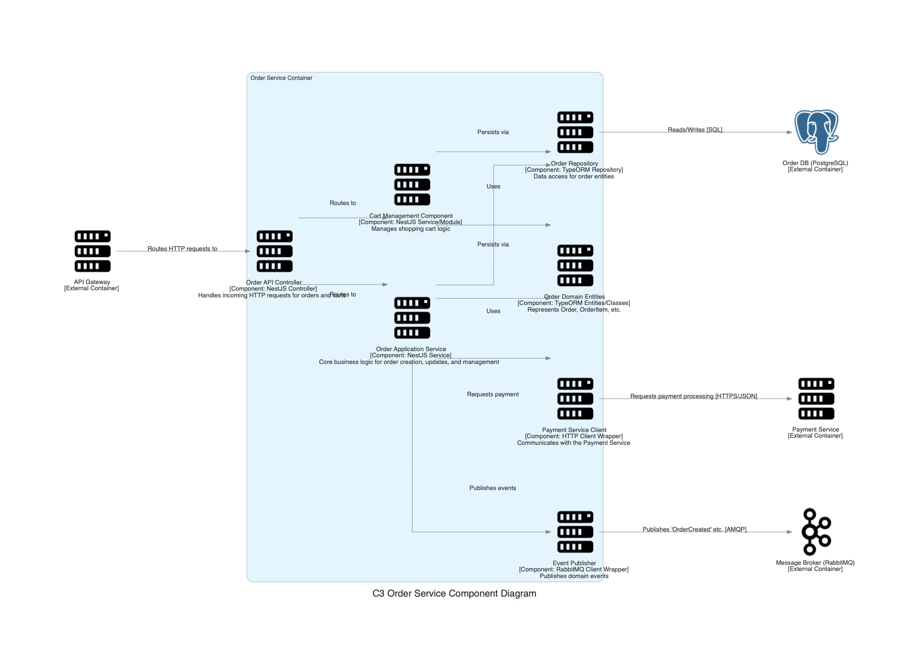

## C3: Component Diagram - Order Service

This diagram zooms into the `Order Service` container, showing its internal components and how they collaborate to fulfill its responsibilities. It also shows how the `Order Service` interacts with other containers or external systems from the C2 diagram's perspective.

### External Dependencies (Containers from C2):
*   **API Gateway:** Routes incoming API requests to the `Order API Controller`.
*   **Order DB:** PostgreSQL database storing order data.
*   **Payment Service:** Processes payment for orders.
*   **Message Broker:** RabbitMQ instance for publishing domain events like "OrderCreated".

### Internal Components:
*   **Order API Controller:** NestJS controller that handles incoming HTTP requests for orders and shopping carts.
*   **Order Application Service:** Core service implementing business logic for order creation, updates, and general order management.
*   **Cart Management Component:** Manages shopping cart functionality.
*   **Order Domain Entities:** TypeORM entities representing Order, OrderItem, and related domain objects.
*   **Order Repository:** TypeORM repository providing data access for order entities.
*   **Payment Service Client:** HTTP client wrapper for communicating with the Payment Service.
*   **Event Publisher:** RabbitMQ client wrapper for publishing domain events.

### Key Interactions:
*   Orders are received via the API Gateway and processed by the Order API Controller.
*   Cart functionality handles pre-order operations and management.
*   The Application Service orchestrates the order process, interacting with repositories and external services.
*   When an order is created or updated, events are published to the Message Broker for other services to consume.
*   Payment processing is delegated to the Payment Service.
