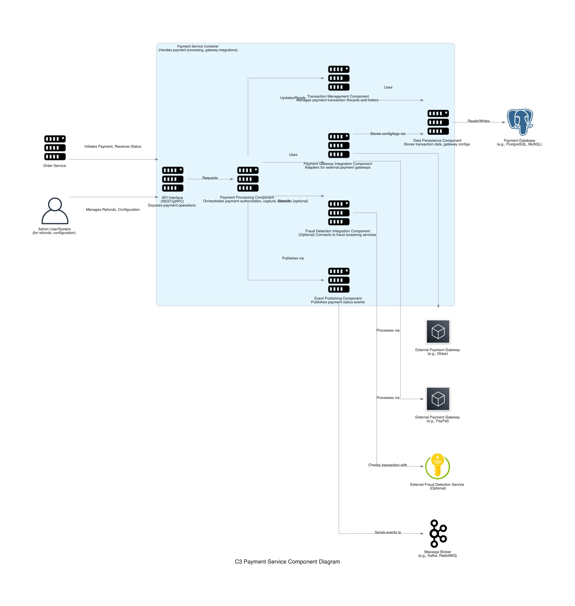

## C3: Component Diagram - Payment Service

This diagram zooms into the `Payment Service` container, showing its internal components and how they collaborate to handle payment processing. It also shows how the `Payment Service` interacts with other containers and external systems from the C2 diagram's perspective.

### External Dependencies:
*   **External Payment Gateways:** Third-party services like Stripe and PayPal that process actual financial transactions.
*   **External Fraud Detection Service:** Optional integration for fraud screening of transactions.
*   **Payment Database:** Stores transaction data, payment history, and gateway configurations.
*   **Message Broker:** For publishing payment events like "PaymentProcessed" or "PaymentFailed".

### External Users/Systems:
*   **Order Service:** Initiates payment requests and receives payment statuses.
*   **Admin User/System:** For managing refunds and payment-related configurations.

### Internal Components:
*   **API Interface:** REST/gRPC endpoints exposing payment operations.
*   **Payment Processing Component:** Orchestrates payment authorization, capture, and refund workflows.
*   **Payment Gateway Integration Component:** Adapters for external payment gateways (e.g., Stripe, PayPal).
*   **Transaction Management Component:** Manages payment transaction lifecycle and history.
*   **Fraud Detection Integration Component:** Optional component connecting to fraud screening services.
*   **Data Persistence Component:** Handles storage of transaction data and gateway configurations.
*   **Event Publishing Component:** Publishes payment status events to the message broker.

### Key Interactions:
*   Payment requests come from the Order Service, processed through the API Interface.
*   The Payment Processing Component orchestrates the payment flow, using appropriate gateways.
*   Transaction Management tracks all payment activities and maintains their state.
*   When fraud detection is enabled, transactions are screened before processing.
*   Payment status events are published for other services to consume.
*   Admin users can initiate refunds and manage payment configurations.
