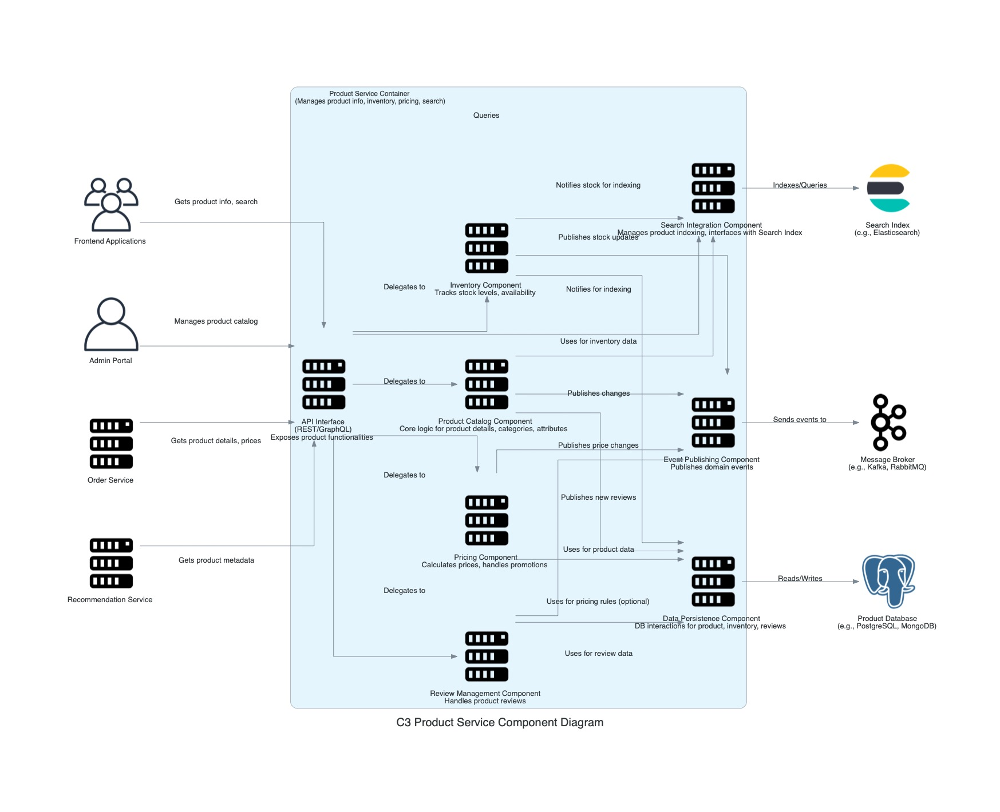

## C3: Component Diagram - Product Service

This diagram zooms into the `Product Service` container, showing its internal components and how they collaborate to manage the product catalog. It also shows how the `Product Service` interacts with other containers and external systems from the C2 diagram's perspective.

### External Dependencies:
*   **Product Database:** Stores product data, inventory levels, pricing, and reviews.
*   **Search Index:** Elasticsearch instance that powers product search functionality.
*   **Message Broker:** For publishing product-related events like "ProductCreated" or "StockUpdated".

### External Users/Systems:
*   **Frontend Applications:** Customer-facing applications that display product information.
*   **Admin Portal:** Used by administrators to manage the product catalog.
*   **Order Service:** Retrieves product details and pricing during order creation.
*   **Recommendation Service:** Uses product metadata for generating recommendations.

### Internal Components:
*   **API Interface:** REST/GraphQL endpoints exposing product functionalities.
*   **Product Catalog Component:** Core logic for product details, categories, and attributes.
*   **Inventory Component:** Tracks stock levels and product availability.
*   **Pricing Component:** Calculates prices and handles promotions.
*   **Search Integration Component:** Manages product indexing and interfaces with the Search Index.
*   **Review Management Component:** Handles product reviews and ratings.
*   **Data Persistence Component:** Manages database interactions for products, inventory, and reviews.
*   **Event Publishing Component:** Publishes domain events to the message broker.

### Key Interactions:
*   The API Interface delegates requests to appropriate internal components.
*   Product data is managed by the Product Catalog Component and persisted via the Data Persistence Component.
*   The Inventory Component tracks stock levels and notifies when availability changes.
*   The Pricing Component handles regular and promotional pricing.
*   The Search Integration Component ensures the search index stays updated with product data.
*   When products, inventory, or prices change, events are published for other services to consume.
*   The Review Management Component handles customer reviews and ratings for products.
