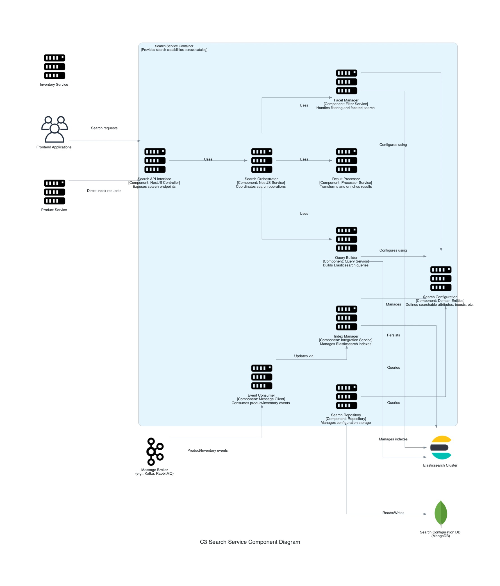

## C3: Component Diagram - Search Service

This diagram zooms into the `Search Service` container, showing its internal components and how they collaborate to provide search capabilities across the product catalog. It also shows how the `Search Service` interacts with other containers and external systems from the C2 diagram's perspective.

### External Dependencies:
*   **Elasticsearch Cluster:** Powers the search functionality with high-performance indexing and querying.
*   **Search Configuration DB:** MongoDB database storing search configurations and metadata.
*   **Message Broker:** Receives events from Product and Inventory services for index updates.

### External Users/Systems:
*   **Frontend Applications:** Customer interfaces that need search functionality.
*   **Product Service:** Provides product data and may request direct indexing.
*   **Inventory Service:** Provides availability updates that affect search results.

### Internal Components:
*   **Search API Interface:** NestJS controllers exposing search endpoints.
*   **Search Orchestrator:** Coordinates search operations and manages the overall flow.
*   **Query Builder:** Builds Elasticsearch queries based on user input and context.
*   **Facet Manager:** Handles filtering and faceted search capabilities.
*   **Result Processor:** Transforms and enriches search results before returning them.
*   **Search Configuration:** Domain entities defining searchable attributes, boosts, etc.
*   **Search Repository:** Manages configuration storage and retrieval.
*   **Index Manager:** Manages Elasticsearch indexes and mappings.
*   **Event Consumer:** Consumes product and inventory events for index updates.

### Key Interactions:
*   Frontend applications send search requests to the Search API.
*   The Search Orchestrator manages the search flow, working with Query Builder, Facet Manager, and Result Processor.
*   Search configurations control how fields are indexed, weighted, and faceted.
*   Product and inventory changes are received as events and processed by the Index Manager to update Elasticsearch.
*   The Index Manager maintains index mappings and handles reindexing operations.
*   All search operations are performed against the Elasticsearch cluster.
*   Search configurations are stored in a dedicated MongoDB database for flexibility.
