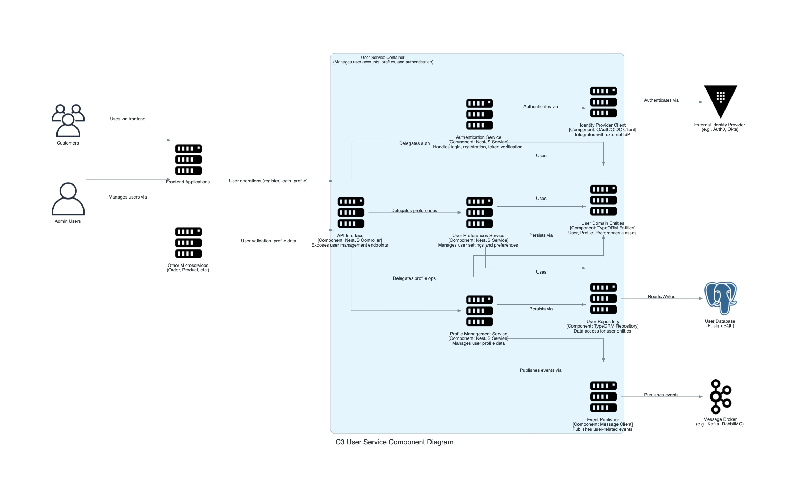

## C3: Component Diagram - User Service

This diagram zooms into the `User Service` container, showing its internal components and how they collaborate to manage user accounts, profiles, and authentication. It also shows how the `User Service` interacts with other containers and external systems from the C2 diagram's perspective.

### External Dependencies:
*   **User Database:** PostgreSQL database storing user profiles, preferences, and account data.
*   **External Identity Provider:** Third-party service (e.g., Auth0, Okta) for authentication.
*   **Message Broker:** For publishing user-related events like "UserRegistered" or "ProfileUpdated".

### External Users/Systems:
*   **Customers:** End users who register and manage their accounts.
*   **Admin Users:** Staff who manage customer accounts.
*   **Frontend Applications:** Customer and admin interfaces.
*   **Other Microservices:** Services that need user data for their operations.

### Internal Components:
*   **API Interface:** NestJS controllers exposing user management endpoints.
*   **Authentication Service:** Handles login, registration, and token verification.
*   **Profile Management Service:** Manages user profile data.
*   **User Preferences Service:** Manages user settings and preferences.
*   **User Domain Entities:** TypeORM entities representing User, Profile, and Preferences.
*   **User Repository:** TypeORM repository providing data access for user entities.
*   **Identity Provider Client:** Integrates with external authentication services.
*   **Event Publisher:** Publishes user-related events to the message broker.

### Key Interactions:
*   Customer registration and authentication flow through the API Interface to the Authentication Service.
*   Profile management operations are handled by the Profile Management Service.
*   User settings and preferences are managed by the User Preferences Service.
*   Authentication is delegated to an external Identity Provider when needed.
*   When user profiles or preferences change, events are published for other services to consume.
