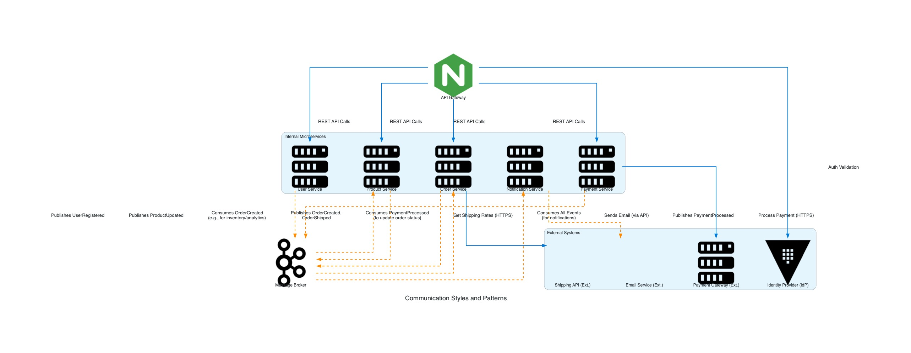

# Communication Styles and Patterns Diagram

This diagram illustrates the various communication styles and patterns employed within the e-commerce platform architecture. It highlights how different services and components interact, distinguishing between synchronous and asynchronous communication.

## Key Components and Roles:

*   **API Gateway:** Acts as the single entry point for most client requests. It routes synchronous (REST API) calls to the appropriate internal microservices and handles initial authentication/authorization steps, often by coordinating with an Identity Provider.
*   **Internal Microservices:**
    *   `User Service`: Manages user accounts and profiles.
    *   `Product Service`: Manages the product catalog.
    *   `Order Service`: Handles order creation, processing, and management.
    *   `Payment Service`: Orchestrates payment processing with external gateways.
    *   `Notification Service`: Responsible for sending out various notifications (email, SMS, etc.) based on events.
*   **Message Broker:** Facilitates asynchronous communication between services through an event-driven approach. Services publish events to the broker, and other interested services subscribe to these events.
*   **External Systems:**
    *   `Identity Provider (IdP)`: Handles user authentication.
    *   `Payment Gateway (Ext.)`: External service for processing payments.
    *   `Email Service (Ext.)`: External service for sending emails.
    *   `Shipping API (Ext.)`: External service for handling shipping logistics (e.g., getting rates, creating shipments).

## Communication Styles Illustrated:

1.  **Synchronous Communication (Blue Lines):**
    *   **Client to API Gateway to Services:** Clients make synchronous HTTP requests (e.g., REST API calls) to the API Gateway, which then forwards these requests synchronously to the relevant backend microservice.
    *   **Service to External Systems:** Some services make direct synchronous calls to external systems when an immediate response is required (e.g., `Payment Service` to `Payment Gateway`, `Order Service` to `Shipping API`).
    *   **API Gateway to Identity Provider:** For request authentication and authorization.

2.  **Asynchronous Communication (Orange Dashed Lines):**
    *   **Event Publishing:** Services publish events to the Message Broker when significant state changes occur (e.g., `UserRegistered`, `ProductUpdated`, `OrderCreated`, `PaymentProcessed`). This decouples the event producer from its consumers.
    *   **Event Consumption:** Services subscribe to specific events from the Message Broker.
        *   The `Notification Service` consumes a wide range of events to trigger relevant user notifications.
        *   The `Order Service` consumes `PaymentProcessed` events to update order statuses.
        *   The `Product Service` (as per the diagram) consumes `OrderCreated` events, potentially for analytics or to trigger related workflows (e.g., checking related product recommendations, though primary inventory updates would likely be handled by an Inventory Service if it were shown in this specific diagram).
    *   **Service to External System (Indirect Asynchronous):** The `Notification Service` consumes internal events and then interacts with an external `Email Service` to dispatch emails. While the call to the email service API might itself be synchronous, the end-to-end flow initiated by an internal event is effectively asynchronous from the perspective of the original event producer.

This diagram helps in understanding the flow of information and the dependencies between different parts of the system, emphasizing the mix of request/response and event-driven interactions.
