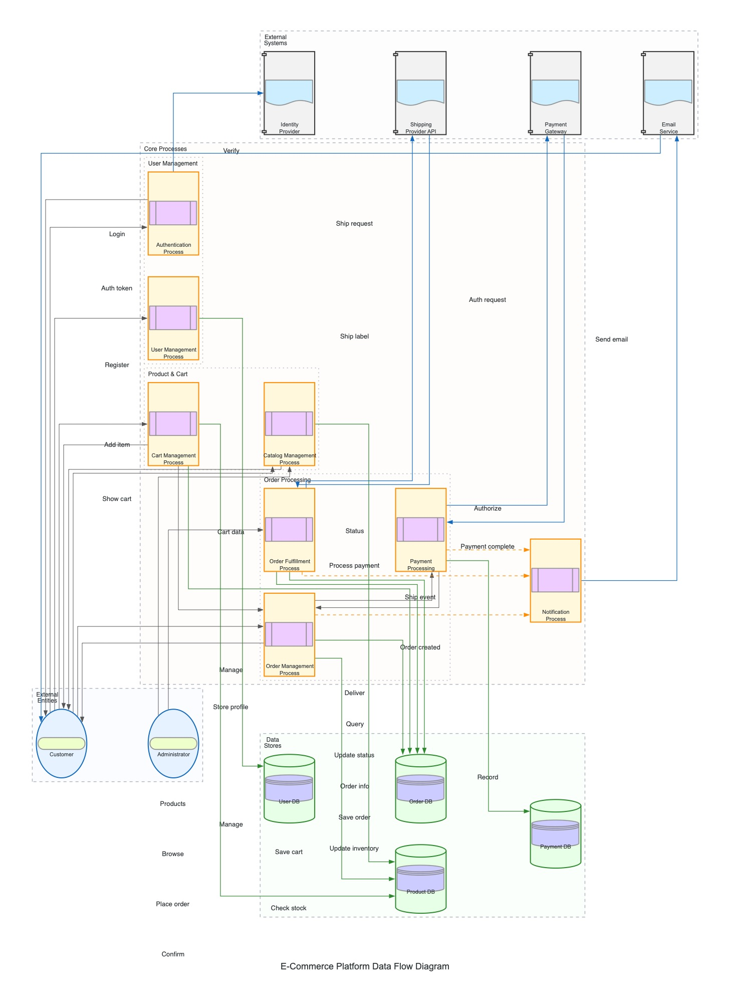

# Data Flow Diagram

This diagram illustrates how data flows through the e-commerce platform, showing the movement and transformation of information between users, processes, data stores, and external systems.

## Data Flow Components

### External Entities
- **Customers**: End users who browse products, maintain carts, and place orders
- **Administrators**: Staff who manage products and fulfill orders

### Core Processes
1. **Authentication Process**: Handles user authentication and authorization
2. **User Management Process**: Manages user profiles and account information
3. **Catalog Management Process**: Handles product browsing, searching, and administration
4. **Cart Management Process**: Manages shopping cart operations
5. **Order Management Process**: Processes order creation and management
6. **Payment Processing**: Handles payment authorization and recording
7. **Order Fulfillment Process**: Manages the post-purchase order fulfillment
8. **Notification Process**: Sends notifications to users based on system events

### Data Stores
- **User DB**: Stores user profiles and account information
- **Product DB**: Stores product catalog, inventory, and category information
- **Order DB**: Stores shopping carts, orders, and their status
- **Payment DB**: Stores payment transaction records

### External Systems
- **Identity Provider**: External system for authentication and user identity management
- **Payment Gateway**: External system for processing payments
- **Shipping Provider**: External API for shipping labels and delivery tracking
- **Email Service**: External service for email delivery

## Key Data Flows

### User Registration and Authentication
1. User submits login credentials to the Authentication Process
2. Authentication Process verifies identity with the Identity Provider
3. Authentication tokens are returned to the user
4. New user registration data flows to the User Management Process
5. User profile information is stored in the User DB

### Product Browsing and Management
1. Customers submit search and browse requests to the Catalog Process
2. Catalog Process queries the Product DB and returns product listings
3. Administrators submit product data to the Catalog Process for storage
4. Product data is stored in the Product DB

### Shopping and Checkout
1. Customer adds items to cart, data flows to Cart Process
2. Cart Process checks product availability and stores cart in Order DB
3. Customer initiates order placement, cart data flows to Order Process
4. Order Process creates orders in Order DB and requests payment
5. Payment Process communicates with Payment Gateway for authorization
6. Payment status flows back to Order Process
7. Order confirmation is returned to the customer

### Order Fulfillment
1. Administrators access order information from Fulfillment Process
2. Fulfillment Process retrieves and updates order data in Order DB
3. Fulfillment Process requests shipping labels from Shipping Provider
4. Shipping Provider returns label and tracking information
5. Delivery updates flow from Shipping Provider to Fulfillment Process

### Notifications
1. Various processes generate events that flow to the Notification Process
2. Notification Process formats data and sends it to Email Service
3. Email Service delivers notifications to customers

This data flow diagram complements the other architectural views by focusing specifically on information movement across the system. It highlights the data transformations and interactions that enable the e-commerce platform's core business processes.
