```mermaid
%%{init: {'theme': 'default', 'flowchart': {'useMaxWidth': false}} }%%
flowchart TB
    %% Kubernetes Cluster and Main Components
    subgraph Cluster ["Kubernetes Cluster"]
        %% Control plane components
        subgraph control ["Control Plane"]
            direction LR
            apiserver["API Server"]
            scheduler["Scheduler"]
            ctrlmgr["Controller<br>Manager"]
            etcd["etcd"]
        end
        
        %% Ingress and API Gateway
        subgraph ingress ["Ingress Layer"]
            direction LR
            ing["NGINX<br>Ingress Controller"]
            extlb["External<br>Load Balancer"]
            apigw["API Gateway<br>(Ambassador/Kong)"]
        end
        
        %% Application Namespaces
        subgraph namespaces ["Application Namespaces"]
            direction TB
            
            subgraph frontend ["Frontend Namespace"]
                direction LR
                custwebapp["Customer Web App<br>Deployment<br><i>3+ pods</i>"]
                adminwebapp["Admin Web App<br>Deployment<br><i>2+ pods</i>"]
            end
            
            subgraph services ["Services Namespace"]
                direction LR
                
                %% Service deployments
                usersvc["User Service<br>Deployment<br><i>2+ pods</i>"]
                productsvc["Product Service<br>Deployment<br><i>3+ pods</i>"]
                ordersvc["Order Service<br>Deployment<br><i>3+ pods</i>"]
                paymentsvc["Payment Service<br>Deployment<br><i>2+ pods</i>"]
                notificationsvc["Notification Service<br>Deployment<br><i>2+ pods</i>"]
                
                %% Kubernetes services (abstractions, not pods)
                usersvc_svc["User<br>Service"]
                productsvc_svc["Product<br>Service"]
                ordersvc_svc["Order<br>Service"]
                paymentsvc_svc["Payment<br>Service"]
                notificationsvc_svc["Notification<br>Service"]
                
                %% Service to Service connection
                usersvc --> usersvc_svc
                productsvc --> productsvc_svc
                ordersvc --> ordersvc_svc
                paymentsvc --> paymentsvc_svc
                notificationsvc --> notificationsvc_svc
            end
            
            subgraph data ["Data Namespace"]
                direction LR
                
                %% Databases
                subgraph postgres ["PostgreSQL Cluster"]
                    direction TB
                    pg_master["Master"]
                    pg_replica1["Replica 1"]
                    pg_replica2["Replica 2"]
                    
                    pg_master --- pg_replica1
                    pg_master --- pg_replica2
                end
                
                %% Message broker
                subgraph rabbitmq ["RabbitMQ Cluster"]
                    direction TB
                    rmq1["Node 1"]
                    rmq2["Node 2"]
                    rmq3["Node 3"]
                    
                    rmq1 --- rmq2
                    rmq1 --- rmq3
                    rmq2 --- rmq3
                end
                
                %% Cache
                subgraph redis ["Redis Cluster"]
                    direction TB
                    redis_master["Master"]
                    redis_replica["Replica"]
                    
                    redis_master --- redis_replica
                end
                
                %% Elasticsearch for search
                subgraph elastic ["Elasticsearch Cluster"]
                    direction TB
                    es1["Node 1"]
                    es2["Node 2"]
                    es3["Node 3"]
                    
                    es1 --- es2
                    es1 --- es3
                    es2 --- es3
                end
            end
            
            %% ConfigMaps and Secrets
            subgraph config ["Configuration"]
                direction LR
                configmaps["ConfigMaps"]
                secrets["Sealed Secrets"]
            end
        end
        
        %% Support services
        subgraph support ["Platform Services"]
            direction TB
            
            subgraph monitoring ["Monitoring & Logging"]
                direction LR
                prometheus["Prometheus"]
                grafana["Grafana"]
                loki["Loki"]
            end
            
            subgraph tracing ["Distributed Tracing"]
                direction LR
                jaeger["Jaeger"]
            end
            
            subgraph cicd ["CI/CD"]
                direction LR
                argocd["ArgoCD"]
            end
        end
    end
    
    %% External services
    subgraph external ["External Services"]
        direction TB
        idp["Identity<br>Provider"]
        payment_gw["Payment<br>Gateway"]
        email_svc["Email<br>Service"]
        shipping_api["Shipping<br>API"]
    end
    
    %% Connections from External LB to services and apps
    extlb --> ing
    ing --> apigw
    ing --> custwebapp
    ing --> adminwebapp
    
    %% Connections from API Gateway to services
    apigw --> usersvc_svc
    apigw --> productsvc_svc
    apigw --> ordersvc_svc
    apigw --> paymentsvc_svc
    
    %% Connections from Services to data stores
    usersvc_svc --> postgres
    productsvc_svc --> postgres
    productsvc_svc --> elastic
    ordersvc_svc --> postgres
    paymentsvc_svc --> postgres
    
    %% Connections to RabbitMQ
    usersvc_svc --> rabbitmq
    productsvc_svc --> rabbitmq
    ordersvc_svc --> rabbitmq
    paymentsvc_svc --> rabbitmq
    notificationsvc_svc --> rabbitmq
    
    %% Connections to Redis
    productsvc_svc --> redis
    ordersvc_svc --> redis
    
    %% Connections to external services
    apigw --> idp
    paymentsvc_svc --> payment_gw
    notificationsvc_svc --> email_svc
    ordersvc_svc --> shipping_api
    
    %% Connections to support services
    monitoring --> namespaces
    tracing --> namespaces
    
    %% Configuration connections
    configmaps --> namespaces
    secrets --> namespaces
    
    %% Styling classes
    classDef controlplanenode fill:#326ce5,color:white
    classDef ingressnode fill:#ff9900,color:white
    classDef servicenode fill:#1168bd,color:white
    classDef servicemeshnode fill:#7c86b1,color:white
    classDef dbnode fill:#438dd5,color:white
    classDef externalnode fill:#999999,color:white
    classDef supportnode fill:#6cb87a,color:white
    classDef confignode fill:#f9dc4b,color:black
    
    %% Apply styles
    class apiserver,scheduler,ctrlmgr,etcd controlplanenode
    class ing,extlb,apigw ingressnode
    class custwebapp,adminwebapp,usersvc,productsvc,ordersvc,paymentsvc,notificationsvc servicenode
    class usersvc_svc,productsvc_svc,ordersvc_svc,paymentsvc_svc,notificationsvc_svc servicemeshnode
    class pg_master,pg_replica1,pg_replica2,rmq1,rmq2,rmq3,redis_master,redis_replica,es1,es2,es3 dbnode
    class idp,payment_gw,email_svc,shipping_api externalnode
    class prometheus,grafana,loki,jaeger,argocd supportnode
    class configmaps,secrets confignode
```

# Kubernetes Deployment Architecture

This diagram illustrates the deployment architecture for the e-commerce platform in a Kubernetes environment. It shows how the different components of the system are deployed, their relationships, and how they're organized within the Kubernetes cluster.

## Architecture Highlights

### Infrastructure Components

1. **Kubernetes Cluster**
   - A managed Kubernetes service (e.g., GKE, EKS, or AKS) providing the core container orchestration
   - Control plane managed by the cloud provider

2. **Ingress Layer**
   - External Load Balancer provisioned by the cloud provider
   - NGINX Ingress Controller for routing external traffic
   - API Gateway (Ambassador or Kong) for API management, routing, and security

3. **Namespaces Organization**
   - Frontend Namespace: Contains the web applications
   - Services Namespace: Contains all microservices
   - Data Namespace: Contains all data stores
   - Configuration: ConfigMaps for non-sensitive configuration, Sealed Secrets for sensitive data

### Application Components

1. **Frontend Applications**
   - Customer Web App (SPA): Horizontally scaled with 3+ pods
   - Admin Web App (SPA): Horizontally scaled with 2+ pods

2. **Microservices**
   - User Service: User profile management
   - Product Service: Product catalog and inventory
   - Order Service: Order processing and cart management
   - Payment Service: Payment processing
   - Notification Service: Handles email and notification delivery
   - Each service is deployed with Kubernetes Deployments for automated scaling and healing

3. **Data Stores**
   - PostgreSQL Cluster: Primary database with replicas for all services
   - RabbitMQ Cluster: Message broker for asynchronous communication
   - Redis Cluster: Caching layer for performance optimization
   - Elasticsearch Cluster: For product search capabilities

### Platform Services

1. **Monitoring & Logging**
   - Prometheus for metrics collection
   - Grafana for metrics visualization
   - Loki for log aggregation

2. **Distributed Tracing**
   - Jaeger for end-to-end request tracing

3. **CI/CD**
   - ArgoCD for GitOps-based continuous delivery

## Key Operational Characteristics

1. **High Availability**
   - All components are deployed with multiple replicas
   - Stateful services use clustered configurations
   - Services are distributed across multiple availability zones

2. **Scalability**
   - Horizontal scaling for all services based on CPU/memory metrics
   - Auto-scaling for frontend apps and key backend services

3. **Resilience**
   - Self-healing through Kubernetes health checks and restarts
   - Circuit breaking patterns for external service calls
   - Retry mechanisms for asynchronous messaging

4. **Security**
   - Network policies controlling inter-service communication
   - Sealed Secrets for sensitive configuration
   - Service accounts with minimal permissions

This deployment architecture aligns with several key architectural decisions:
- ADR-006: Cloud-Native Deployment Strategy
- ADR-015: Service Discovery (using Kubernetes native mechanisms)
- ADR-016: Configuration Management Strategy
- ADR-002: Event-Driven Architecture (RabbitMQ deployment)
- ADR-004: PostgreSQL for Relational Data
- ADR-008: Decentralized Data with Polyglot Persistence
