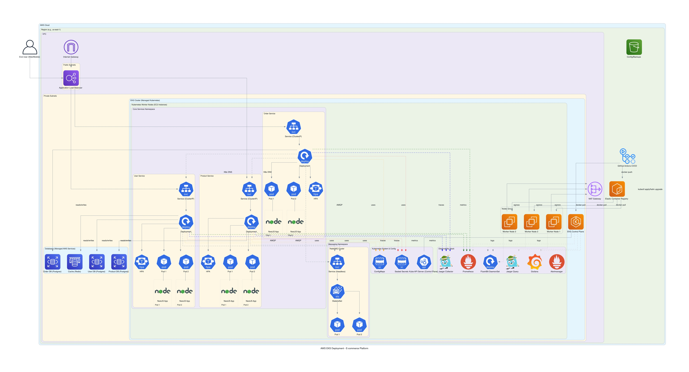

## AWS EKS Deployment Architecture

This diagram illustrates the primary deployment architecture of the e-commerce platform on AWS Elastic Kubernetes Service (EKS).

### Key Components:

- **AWS EKS Cluster:** The core Kubernetes environment managing containerized microservices.
- **VPC Networking:** Includes public and private subnets, Application Load Balancer (ALB) for ingress, and NAT Gateway for egress.
- **Microservices:** User, Product, and Order services deployed as Kubernetes Deployments.
- **Managed Databases:** RDS (PostgreSQL) for persistent data storage and ElastiCache (Redis) for caching.
- **Messaging:** RabbitMQ cluster deployed within Kubernetes for asynchronous communication (See ADR-018).
- **Observability:** Includes Prometheus, Grafana, Jaeger, and FluentBit for monitoring, tracing, and logging (See ADR-011, ADR-017).
- **CI/CD:** Integration with GitHub Actions for automated builds and deployments, using ECR for image storage (See ADR-012).
- **Configuration & Secrets:** Uses Kubernetes ConfigMaps and Sealed Secrets (See ADR-016).
- **Service Discovery:** Relies on Kubernetes native DNS (See ADR-015).

This architecture leverages managed AWS services and Kubernetes to provide a scalable, resilient, and observable platform.
