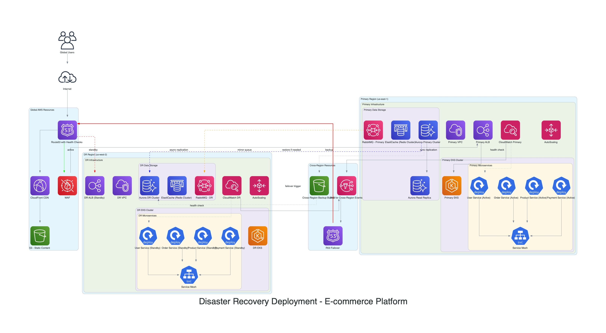

# Disaster Recovery Deployment Strategy

This diagram outlines the disaster recovery (DR) strategy for the e-commerce platform, ensuring high availability and business continuity in case of a regional failure.

## Strategy Overview:

- **Multi-Region Deployment**: The application is deployed across two AWS regions (e.g., `us-east-1` and `us-west-2`).
- **Active-Passive Setup**: One region serves as the primary (active) region, while the other serves as the secondary (passive) standby region.
- **Route 53 Failover**: AWS Route 53 is configured with health checks and failover routing policies. If the primary region becomes unavailable, Route 53 automatically redirects traffic to the secondary region.

## Key Components & Replication:

- **EKS Clusters**: Separate EKS clusters are maintained in each region.
- **Database Replication**:
  - **RDS PostgreSQL**: Uses cross-region read replicas or global databases for data synchronization.
  - **ElastiCache Redis**: May use replication groups or rely on cache warming strategies upon failover.
- **Messaging Queue (RabbitMQ)**: Cluster federation or shovel plugins can be used to replicate messages across regions, though achieving perfect consistency can be complex.
- **Container Images (ECR)**: ECR repositories are replicated across regions to ensure images are available for deployment in the failover region.
- **Configuration & State**: Infrastructure-as-Code (e.g., Terraform, CloudFormation) and configuration management tools ensure consistent environments. Application state management needs careful consideration (e.g., session data).

## Failover Process:

1. Health checks detect failure in the primary region.
2. Route 53 updates DNS records to point to the secondary region's ALB.
3. The secondary region's infrastructure scales up (if necessary) to handle the full production load.
4. Databases and other stateful services in the secondary region become primary.

Regular DR testing is crucial to validate the effectiveness of this strategy.
