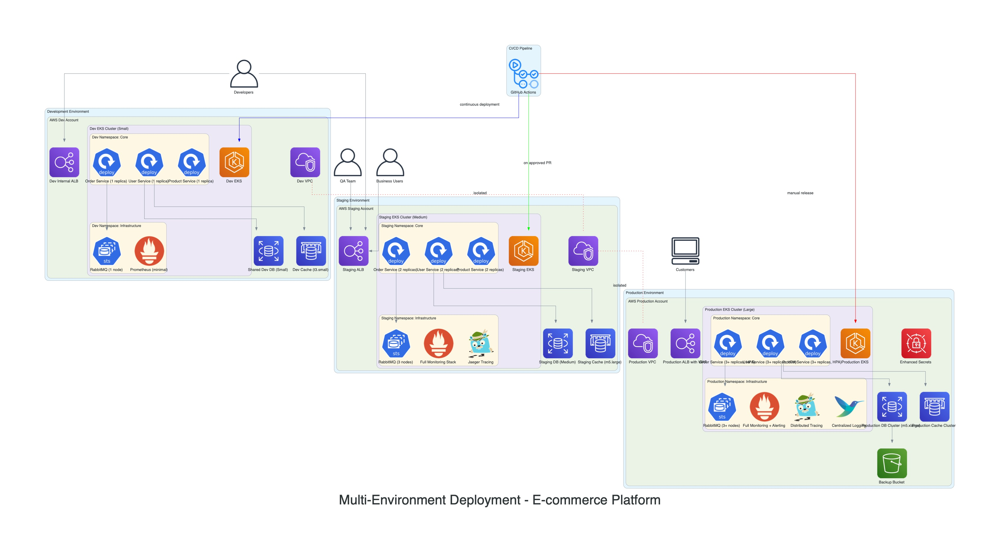

# Multi-Environment Deployment Strategy

This diagram illustrates the deployment strategy across different environments: Development, Staging, and Production.

## Environment Comparison:

- **Development (Dev)**:

  - **Purpose**: Used by developers for coding, local testing, and feature development.
  - **Infrastructure**: Typically scaled down, may use mock services or smaller database instances. Focus is on rapid iteration.
  - **Data**: Synthetic or anonymized data.
  - **Deployment**: Frequent, often automated on every code commit.

- **Staging**:

  - **Purpose**: Pre-production environment mirroring Production as closely as possible. Used for integration testing, UAT, and performance testing.
  - **Infrastructure**: Scaled similarly to Production, but potentially smaller. Uses near-production configurations.
  - **Data**: May use a sanitized copy of production data or realistic test data.
  - **Deployment**: Automated after successful testing in Dev and CI checks pass. Deployed periodically (e.g., daily, weekly).

- **Production (Prod)**:
  - **Purpose**: Live environment serving end-users.
  - **Infrastructure**: Fully scaled for performance, high availability, and resilience. Strict security measures in place.
  - **Data**: Real user data.
  - **Deployment**: Controlled and scheduled releases, often requiring manual approval after thorough testing in Staging. Rollback plans are essential.

Each environment utilizes a separate EKS cluster or namespace within a cluster, distinct database instances, and potentially different configurations managed via tools like Helm or Kustomize.
