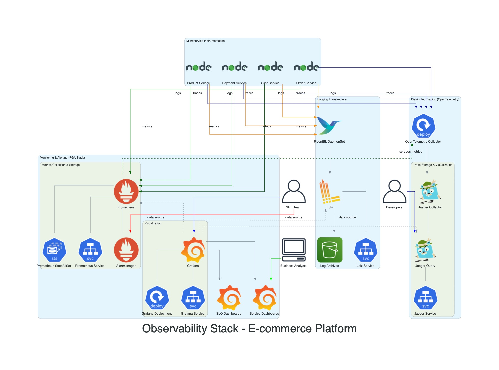

# Observability Stack Architecture

This diagram details the observability stack used for monitoring, logging, and tracing the e-commerce platform running on EKS.

## Components:

- **Metrics**:
  - **Prometheus**: Collects metrics from microservices and infrastructure components via exporters (e.g., Node Exporter, cAdvisor).
  - **Grafana**: Visualizes metrics collected by Prometheus through dashboards.
- **Logging**:
  - **FluentBit**: Deployed as a DaemonSet on EKS nodes, collects logs from containers and forwards them to a central logging system (e.g., Elasticsearch, CloudWatch Logs, Loki).
- **Tracing**:
  - **Jaeger**:
    - **Agent**: Deployed as a sidecar or DaemonSet, receives spans from applications.
    - **Collector**: Receives spans from Jaeger Agents and stores them.
    - **Query**: Service for retrieving traces from storage.
    - **UI**: Web interface for visualizing traces.

This stack provides comprehensive insights into application performance, helps diagnose issues, and monitors the overall health of the system.
