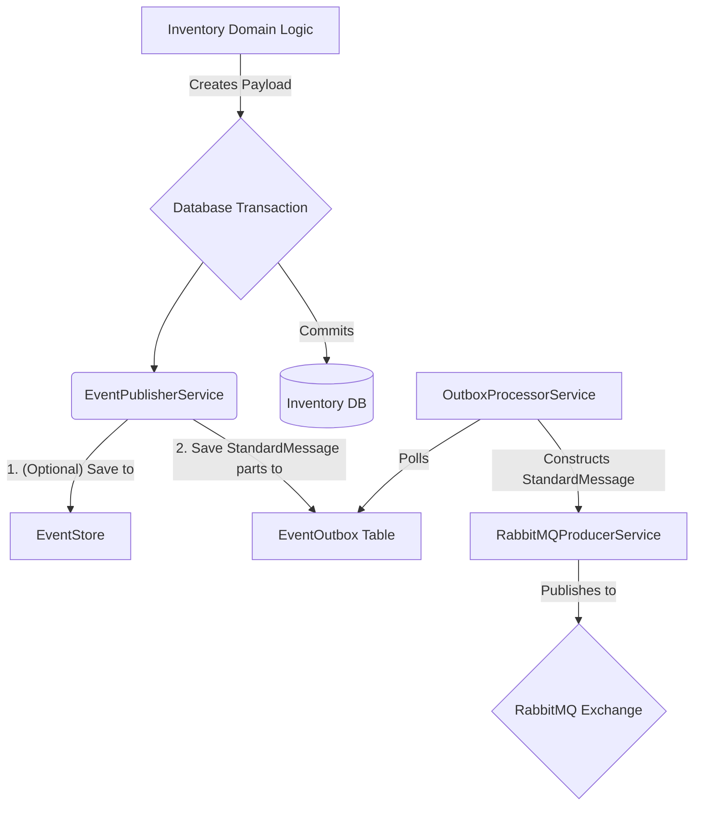

# Event Publisher Implementation for Inventory Service

## 1. Overview

This document details the implementation of the event publishing mechanism in the Inventory Service. The primary goal is to reliably publish domain event payloads, wrapped in the standard `StandardMessage<T>` envelope, to RabbitMQ. This is achieved using the Outbox Pattern, facilitated by the `@ecommerce-platform/rabbitmq-event-utils` shared library for the actual RabbitMQ interaction.

## 2. Publisher Architecture & Outbox Pattern

The Inventory Service employs the [Transactional Outbox Pattern](https://microservices.io/patterns/data/transactional-outbox.html). This ensures that domain events are published reliably as part of the same transaction that commits business state changes.

**Flow:**

1.  Business logic in a service method creates an event payload.
2.  The `EventPublisherService` is called within the same database transaction.
3.  The `EventPublisherService`:
    a. Optionally, persists the full event to an internal `EventStore` (if event sourcing is used for the service's own state).
    b. Persists the essential components of the `StandardMessage<T>` (including the payload) to an `EventOutbox` table.
4.  A separate `OutboxProcessorService` periodically polls the `EventOutbox` table for pending messages.
5.  The `OutboxProcessorService` constructs the full `StandardMessage<T>` and uses the `RabbitMQProducerService` (from `@ecommerce-platform/rabbitmq-event-utils`) to publish it to RabbitMQ.



## 3. Implementation Components

### 3.1. `EventOutbox` Entity

This TypeORM entity represents a message waiting to be published. It stores the components needed to construct a `StandardMessage<T>`.

```typescript
import {
  Entity,
  PrimaryColumn,
  Column,
  CreateDateColumn,
  UpdateDateColumn,
  VersionColumn,
} from "typeorm";

export enum OutboxStatus {
  PENDING = "PENDING",
  PROCESSING = "PROCESSING", // Optional: if locking rows during processing
  PUBLISHED = "PUBLISHED",
  FAILED = "FAILED",
}

@Entity("inventory_event_outbox")
export class EventOutbox {
  @PrimaryColumn("uuid") // Use a UUID for the outbox entry itself or re-use messageId
  id: string;

  @Column("uuid", { comment: "The messageId for StandardMessage<T>" })
  messageId: string;

  @Column({ length: 255, comment: "Matches messageType in StandardMessage<T>" })
  messageType: string;

  @Column({
    length: 255,
    comment: "Matches source in StandardMessage<T>, e.g., inventory-service",
  })
  source: string;

  @Column({ type: "text", comment: "JSON string of the event payload" })
  payloadJson: string;

  @Column({ length: 50, comment: "Version of the payload schema, e.g., 1.0" })
  payloadVersion: string;

  @Column({
    length: 255,
    nullable: true,
    comment: "Optional: Partition key for RabbitMQ routing",
  })
  partitionKey?: string;

  @Column({
    length: 255,
    nullable: true,
    comment: "Optional: Correlation ID for tracing",
  })
  correlationId?: string;

  @Column({
    type: "timestamp with time zone",
    comment: "When the original event occurred or was intended for",
  })
  eventTimestamp: Date;

  @Column({ type: "enum", enum: OutboxStatus, default: OutboxStatus.PENDING })
  status: OutboxStatus;

  @CreateDateColumn({ type: "timestamp with time zone" })
  createdAt: Date;

  @UpdateDateColumn({ type: "timestamp with time zone" })
  updatedAt: Date;

  @Column({ type: "timestamp with time zone", nullable: true })
  publishedAt?: Date;

  @Column({ default: 0 })
  retryCount: number;

  @Column({ type: "text", nullable: true })
  lastError?: string;

  // Optional: For optimistic locking if rows are marked as PROCESSING
  // @VersionColumn()
  // recordVersion: number;
}
```

### 3.2. `EventPublisherService`

This service is responsible for saving event data to the `EventOutbox` table within a transaction.

```typescript
import { Injectable, Logger } from "@nestjs/common";
import { InjectRepository } from "@nestjs/typeorm";
import { Repository, EntityManager } from "typeorm";
import { EventOutbox, OutboxStatus } from "./entities/event-outbox.entity"; // Adjust path
import { v4 as uuidv4 } from "uuid";
// import { EventStore } from './entities/event-store.entity'; // If using an event store
// import { EventSchemaValidator } from './event-schema.validator'; // If validation is done here

export interface EventToPublish<P> {
  messageType: string;
  payload: P;
  payloadVersion: string;
  partitionKey?: string;
  correlationId?: string;
  eventTimestamp?: Date; // When the business event occurred
}

@Injectable()
export class EventPublisherService {
  private readonly logger = new Logger(EventPublisherService.name);
  private readonly serviceSource = "inventory-service"; // Hardcoded source

  constructor() // Inject EntityManager to ensure operations occur within the calling transaction
  // The repository can be obtained from entityManager if needed, or injected directly if using cls-hooked for context.
  // For simplicity, assuming methods are called with an active EntityManager from the business service.

  // @InjectRepository(EventOutbox) // If not using shared EM
  // private readonly outboxRepository: Repository<EventOutbox>,
  // @InjectRepository(EventStore) // Optional
  // private readonly eventStoreRepository: Repository<EventStore>,
  // private readonly schemaValidator: EventSchemaValidator, // Optional validation step here
  {}

  async scheduleEventForPublish<P>(
    eventDetail: EventToPublish<P>,
    entityManager: EntityManager
  ): Promise<string> {
    const messageId = uuidv4();
    const eventTimestamp = eventDetail.eventTimestamp || new Date();

    this.logger.debug(
      `Scheduling event for outbox: ${eventDetail.messageType}, messageId: ${messageId}`
    );

    // Optional: Validate payload schema before saving to outbox
    // const isValid = await this.schemaValidator.validate(eventDetail.messageType, eventDetail.payloadVersion, eventDetail.payload);
    // if (!isValid) {
    //   const errorMsg = `Event payload for ${eventDetail.messageType} v${eventDetail.payloadVersion} failed schema validation`;
    //   this.logger.error(errorMsg);
    //   throw new Error(errorMsg); // Or a custom validation error
    // }

    // Optional: Persist to a separate EventStore entity if doing event sourcing for own service
    // const eventStoreEntry = entityManager.create(EventStore, { /* ... */ });
    // await entityManager.save(EventStore, eventStoreEntry);

    const outboxEntry = entityManager.create(EventOutbox, {
      id: uuidv4(), // ID for the outbox row itself
      messageId,
      messageType: eventDetail.messageType,
      source: this.serviceSource,
      payloadJson: JSON.stringify(eventDetail.payload),
      payloadVersion: eventDetail.payloadVersion,
      partitionKey: eventDetail.partitionKey,
      correlationId: eventDetail.correlationId,
      eventTimestamp: eventTimestamp,
      status: OutboxStatus.PENDING,
      retryCount: 0,
    });

    await entityManager.save(EventOutbox, outboxEntry);
    this.logger.log(
      `Event ${messageId} (${eventDetail.messageType}) scheduled in outbox.`
    );
    return messageId;
  }

  // Method to publish multiple events, ensuring all are part of the same transaction
  async scheduleMultipleEventsForPublish<P>(
    events: EventToPublish<P>[],
    entityManager: EntityManager
  ): Promise<string[]> {
    const messageIds: string[] = [];
    for (const eventDetail of events) {
      const messageId = await this.scheduleEventForPublish(
        eventDetail,
        entityManager
      );
      messageIds.push(messageId);
    }
    return messageIds;
  }
}
```

### 3.3. `OutboxProcessorService`

This service runs periodically (e.g., via a cron job or interval), picks up pending messages from `EventOutbox`, and publishes them using `RabbitMQProducerService`.

```typescript
import {
  Injectable,
  Logger,
  OnModuleInit,
  OnModuleDestroy,
} from "@nestjs/common";
import { InjectRepository } from "@nestjs/typeorm";
import { Repository, LessThanOrEqual, IsNull, Not } from "typeorm";
import { EventOutbox, OutboxStatus } from "./entities/event-outbox.entity"; // Adjust path
import {
  RabbitMQProducerService,
  StandardMessage,
} from "@ecommerce-platform/rabbitmq-event-utils";
import { ConfigService } from "@nestjs/config"; // For configuration
import { Cron, CronExpression } from "@nestjs/schedule"; // Or use setInterval

@Injectable()
export class OutboxProcessorService implements OnModuleInit {
  private readonly logger = new Logger(OutboxProcessorService.name);
  private readonly exchangeName = "inventory.events"; // Configurable

  constructor(
    @InjectRepository(EventOutbox)
    private readonly outboxRepository: Repository<EventOutbox>,
    private readonly producerService: RabbitMQProducerService,
    private readonly configService: ConfigService
  ) {}

  // Example using @nestjs/schedule cron job
  @Cron(CronExpression.EVERY_5_SECONDS) // Adjust frequency as needed
  async processPendingMessages(): Promise<void> {
    this.logger.debug("Checking for pending outbox messages...");
    const batchSize = this.configService.get<number>(
      "inventory.outbox.batchSize",
      10
    );
    const maxRetries = this.configService.get<number>(
      "inventory.outbox.maxRetries",
      3
    );

    // Find pending or failed-but-retriable messages
    // Could also implement row locking (SELECT ... FOR UPDATE SKIP LOCKED) for multi-instance safety
    const messagesToProcess = await this.outboxRepository.find({
      where: [
        { status: OutboxStatus.PENDING },
        {
          status: OutboxStatus.FAILED,
          retryCount: LessThanOrEqual(maxRetries - 1),
        }, // process if retries < maxRetries
      ],
      order: { createdAt: "ASC" },
      take: batchSize,
    });

    if (messagesToProcess.length === 0) {
      this.logger.debug("No pending outbox messages to process.");
      return;
    }

    this.logger.log(
      `Found ${messagesToProcess.length} messages to process from outbox.`
    );

    for (const outboxMessage of messagesToProcess) {
      // Optional: Mark as PROCESSING if using row locking
      // outboxMessage.status = OutboxStatus.PROCESSING;
      // await this.outboxRepository.save(outboxMessage);

      const standardMessage: StandardMessage<any> = {
        messageId: outboxMessage.messageId,
        messageType: outboxMessage.messageType,
        source: outboxMessage.source,
        timestamp: outboxMessage.eventTimestamp.toISOString(),
        payload: JSON.parse(outboxMessage.payloadJson), // Assuming payloadJson is valid JSON
        version: outboxMessage.payloadVersion,
        partitionKey: outboxMessage.partitionKey,
        correlationId: outboxMessage.correlationId,
      };

      try {
        // Define routing key. Example: inventory.StockLevelChanged.prod-123
        // The producer service might also allow setting routing key per message.
        const routingKey = `${this.exchangeName}.${
          standardMessage.messageType
        }${
          standardMessage.partitionKey ? "." + standardMessage.partitionKey : ""
        }`;

        await this.producerService.publish(
          this.exchangeName,
          routingKey, // Or pass routingKey directly if producer supports it per message
          standardMessage
        );

        outboxMessage.status = OutboxStatus.PUBLISHED;
        outboxMessage.publishedAt = new Date();
        this.logger.log(
          `Message ${outboxMessage.messageId} (${outboxMessage.messageType}) published successfully.`
        );
      } catch (error) {
        this.logger.error(
          `Failed to publish message ${outboxMessage.messageId} (${outboxMessage.messageType}). Error: ${error.message}`,
          error.stack
        );
        outboxMessage.retryCount += 1;
        outboxMessage.lastError = error.message.substring(0, 500); // Truncate error
        if (outboxMessage.retryCount >= maxRetries) {
          outboxMessage.status = OutboxStatus.FAILED;
          this.logger.error(
            `Message ${outboxMessage.messageId} reached max retries and marked as FAILED.`
          );
          // Optionally, publish to a dead-letter topic or raise an alert
        } else {
          outboxMessage.status = OutboxStatus.PENDING; // Will be picked up again for retry
        }
      } finally {
        await this.outboxRepository.save(outboxMessage);
      }
    }
  }

  async onModuleInit() {
    this.logger.log(
      "OutboxProcessorService initialized. Starting to process messages if any on startup."
    );
    // Optional: Run once on startup in case of pending messages from a previous shutdown
    // await this.processPendingMessages(); // Be cautious with @Cron and manual call on init
  }
}
```

### 3.4. `EventSchemaValidator` (Optional, for Payloads)

If schema validation of payloads is desired before storing in the outbox or before publishing by the `OutboxProcessorService`.

```typescript
import { Injectable, Logger } from "@nestjs/common";
import Ajv, { ValidateFunction } from "ajv";
// import { SchemaRegistryService } from './schema-registry.service'; // If schemas are dynamically loaded

@Injectable()
export class EventSchemaValidator {
  private ajv: Ajv;
  private validators: Map<string, ValidateFunction> = new Map();
  private readonly logger = new Logger(EventSchemaValidator.name);

  constructor(/* private schemaRegistry: SchemaRegistryService */) {
    this.ajv = new Ajv({ allErrors: true });
    // Add custom formats if needed, e.g., this.ajv.addFormat('uuid', /.../);
    // TODO: Load payload schemas (e.g., from JSON files or a registry service)
    // this.loadSchemas();
  }

  // private async loadSchemas(): Promise<void> {
  //   // Example: Load schemas for messageType + version
  //   // const stockLevelChangedV1Schema = { /* ... JSON Schema for StockLevelChangedPayload V1 ... */ };
  //   // const key = this.getSchemaKey('StockLevelChanged', '1.0');
  //   // this.validators.set(key, this.ajv.compile(stockLevelChangedV1Schema));
  //   this.logger.log('Payload schemas loaded/compiled.');
  // }

  private getSchemaKey(messageType: string, payloadVersion: string): string {
    return `${messageType}:${payloadVersion}`;
  }

  async validate<P>(
    messageType: string,
    payloadVersion: string,
    payload: P
  ): Promise<boolean> {
    const key = this.getSchemaKey(messageType, payloadVersion);
    const validate = this.validators.get(key);

    if (!validate) {
      this.logger.warn(
        `No schema validator found for ${key}. Skipping validation.`
      );
      return true; // Or false, depending on policy for missing schemas
    }

    const isValid = validate(payload);
    if (!isValid && validate.errors) {
      this.logger.error(
        `Payload validation failed for ${key}:`,
        validate.errors
      );
      return false;
    }
    return true;
  }
}
```

## 4. Configuration (Conceptual)

Relevant configurations (e.g., in `.env` or a config module):

```
# Outbox Processing
INVENTORY_OUTBOX_CRON_EXPRESSION=*/5 * * * * * // Every 5 seconds
INVENTORY_OUTBOX_BATCH_SIZE=10
INVENTORY_OUTBOX_MAX_RETRIES=3

# RabbitMQ (covered by rabbitmq-event-utils, but exchange name might be specific)
INVENTORY_RABBITMQ_EXCHANGE_NAME=inventory.events
```

## 5. Example Usage in `InventoryService`

```typescript
import { Injectable, Logger } from "@nestjs/common";
import { EntityManager } from "typeorm"; // Important for transactions
import {
  EventPublisherService,
  EventToPublish,
} from "./event-publisher.service"; // Adjust path
// Other imports: StockLevelChangedPayload, domain entities etc.

@Injectable()
export class InventoryServiceInternal {
  private readonly logger = new Logger(InventoryServiceInternal.name);

  constructor(
    private readonly eventPublisher: EventPublisherService,
    private readonly entityManager: EntityManager // Injected or obtained transactionally
  ) {}

  async adjustStockLevel(/* ... params ... */): Promise<void> {
    // Assume runInTransaction is a utility that handles TypeORM transactions
    // and passes the transactional EntityManager to the callback.
    await this.entityManager.transaction(async (transactionalEM) => {
      // 1. Perform business logic & save domain entities using transactionalEM
      // const item = await transactionalEM.findOne(InventoryItem, ...);
      // item.quantityAvailable += adjustmentAmount;
      // await transactionalEM.save(item);
      this.logger.log("Business entities updated within transaction.");

      // 2. Define the event payload
      const payload: /* StockLevelChangedPayload */ any = {
        // ... populate based on previous and new state
        inventoryItemId: "item-id-123",
        productId: "prod-id-456",
        sku: "SKU123",
        warehouseId: "wh-01",
        changeType: "adjustment",
        previousQuantityAvailable: 100,
        newQuantityAvailable: 110,
        quantityChanged: 10,
      };

      // 3. Schedule event for publishing using the SAME transactional EntityManager
      const eventDetail: EventToPublish<any> = {
        messageType: "StockLevelChanged",
        payload: payload,
        payloadVersion: "1.0",
        partitionKey: payload.productId, // Example partition key
        correlationId: "some-correlation-id",
      };

      await this.eventPublisher.scheduleEventForPublish(
        eventDetail,
        transactionalEM
      );
      this.logger.log(
        "StockLevelChanged event scheduled in outbox within transaction."
      );
    });
  }
}
```

## 6. Key Considerations

- **Transaction Management**: Ensuring that `EventPublisherService.scheduleEventForPublish` is called with the same `EntityManager` instance used for business data changes is crucial for atomicity.
- **`OutboxProcessorService` Robustness**: It should handle errors gracefully, implement retries, and have mechanisms for dead-lettering messages that consistently fail to publish.
- **Scalability**: For high-throughput systems, consider strategies for scaling the `OutboxProcessorService` (e.g., competing consumers pattern on the outbox table, though this adds complexity with row locking).
- **Monitoring**: Monitor the depth of the `EventOutbox` table, retry rates, and failure rates.
- The `RabbitMQProducerService` from `@ecommerce-platform/rabbitmq-event-utils` is expected to handle its own connection pooling, reconnections, and publisher confirms.

## 7. Handling Persistent Outbox Failures

When an event in the `EventOutbox` table consistently fails to publish to RabbitMQ even after all configured retries (i.e., its status is marked as `FAILED`), it's crucial to have a strategy to address these persistent failures. Simply leaving them in the outbox can lead to data inconsistencies or missed critical events downstream.

**Recommended Strategies:**

1.  **Alerting**: Implement robust alerting to notify the development/operations team immediately when an outbox message is marked as `FAILED`. This alert should include:
    - `messageId`, `messageType`, `source`
    - `lastError` details
    - Timestamp of failure
2.  **Dedicated Dead Letter Queue/Topic (for Outbox Failures)**: While RabbitMQ itself has DLXs for consumer-side issues, consider a separate mechanism for outbox publishing failures. This could be:
    - **Manual DLQ Table**: A separate database table (`inventory_event_outbox_dlq`) where failed messages are moved for manual inspection and potential reprocessing or archival.
    - **Publishing to a Specific Error Topic/Queue**: If the failure is not with RabbitMQ connectivity itself but perhaps with message validation at the broker (though less likely with pre-validation), the `OutboxProcessorService` could attempt to publish the problematic message (or its summary) to a dedicated error topic/queue in RabbitMQ (e.g., `inventory.events.publish_failures`). This allows a separate consumer to handle these specific errors.
3.  **Manual Reprocessing Tools**: Develop tooling or scripts that allow authorized personnel to:
    - View failed outbox messages.
    - Manually attempt to republish them after addressing the root cause (e.g., fixing a malformed payload, resolving a temporary broker issue that outlasted retries).
    - Mark messages as permanently unpublishable and archive them if necessary.
4.  **Root Cause Analysis**: Establish a process for investigating persistent failures. Common causes include:
    - Prolonged RabbitMQ unavailability.
    - Persistent network issues between the service and RabbitMQ.
    - Serialization/deserialization errors if payloads become corrupted.
    - Unexpected changes in RabbitMQ exchange/queue configurations or permissions.
    - Bugs in the `OutboxProcessorService` or `RabbitMQProducerService`.

Choosing the right combination of these strategies depends on the criticality of the events and the operational capacity of the team. At a minimum, robust alerting and a clear process for manual inspection and intervention are essential.
