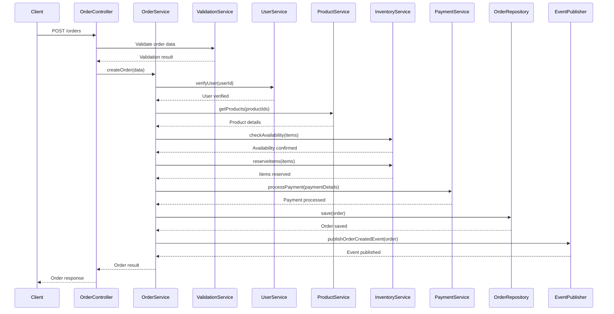
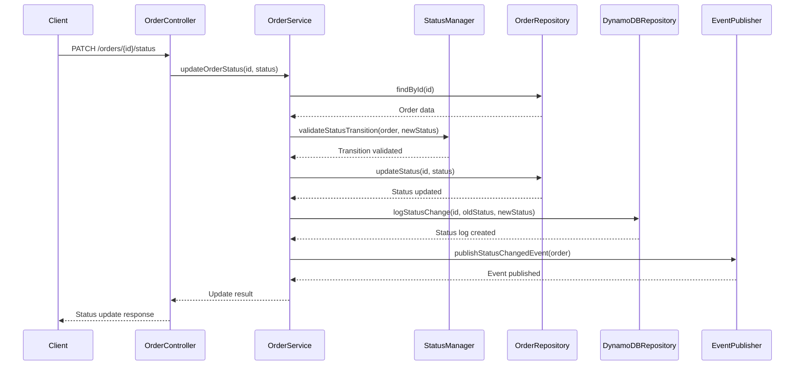

# Order Service Components

## Introduction

This document provides an overview of the core service components that make up the Order Service. The Order Service is implemented using NestJS, following a clean architecture approach with clear separation of concerns. These specifications define the internal structure, business logic, and component interactions within the service.

## Architecture Overview

The Order Service follows a layered architecture pattern:

```
┌─────────────────────────────────────────────────────────────┐
│                      Controllers Layer                       │
│ (API endpoints, request handling, response transformation)   │
└───────────────────────────────┬─────────────────────────────┘
                                │
┌───────────────────────────────▼─────────────────────────────┐
│                      Services Layer                          │
│ (Business logic, orchestration, domain rules)                │
└───────────────────────────────┬─────────────────────────────┘
                                │
┌───────────────────────────────▼─────────────────────────────┐
│                    Repositories Layer                        │
│ (Data access, persistence, queries)                          │
└───────────────────────────────┬─────────────────────────────┘
                                │
┌───────────────────────────────▼─────────────────────────────┐
│                         Data Layer                           │
│ (Database, data models, migrations)                          │
└─────────────────────────────────────────────────────────────┘
```

## Component Specifications

### Core Components

The Order Service consists of the following major components:

| Component                   | Purpose                            | Description                                    |
| --------------------------- | ---------------------------------- | ---------------------------------------------- |
| Order Controller            | API endpoints for order management | Handles HTTP requests for order operations     |
| Order Service               | Core business logic for orders     | Orchestrates order creation, updates, queries  |
| Order Repository            | Data access for order entities     | Provides CRUD operations for order data        |
| Order Status Manager        | Handles order status transitions   | Manages and validates order status changes     |
| Payment Integration Service | Integrates with Payment Service    | Handles payment verification and updates       |
| Inventory Integration       | Integrates with Inventory Service  | Manages inventory checks and reservations      |
| Order Event Publisher       | Publishes events for order changes | Emits domain events for order state changes    |
| Order Validation Service    | Validates order data               | Ensures order data meets business requirements |

### Detailed Component Specifications

Each component is described in detail in its own specification document:

- [01-order-controller.md](./01-order-controller.md): API endpoint definitions
- [02-order-service.md](./02-order-service.md): Business logic implementation
- [03-order-repository.md](./03-order-repository.md): Data access patterns
- [04-order-status-manager.md](./04-order-status-manager.md): Status transition management
- [05-integration-services.md](./05-integration-services.md): External service integration
- [06-event-publisher.md](./06-event-publisher.md): Domain event publishing
- [07-validation-service.md](./07-validation-service.md): Data validation rules

## Core Workflows

### 1. Order Creation Workflow



### 2. Order Status Update Workflow



## Implementation Guidelines

### Technology Stack

- **Framework**: NestJS (Node.js)
- **Language**: TypeScript
- **ORM**: TypeORM for PostgreSQL access
- **SDK**: AWS SDK for JavaScript v3 for DynamoDB access
- **Messaging**: AWS SNS/SQS for event publishing
- **Validation**: class-validator and class-transformer
- **Testing**: Jest for unit and integration testing

### Code Organization

The Order Service code is organized into the following module structure:

```
src/
├── main.ts                         # Application entry point
├── app.module.ts                   # Root module
├── order/                          # Order module
│   ├── order.module.ts             # Order module definition
│   ├── controllers/                # API controllers
│   │   ├── order.controller.ts     # Order endpoints
│   │   └── dto/                    # Data transfer objects
│   ├── services/                   # Business logic services
│   │   ├── order.service.ts        # Core order service
│   │   ├── status-manager.service.ts # Status management
│   │   └── validation.service.ts   # Validation logic
│   ├── repositories/               # Data access
│   │   ├── order.repository.ts     # PostgreSQL repository
│   │   └── status-log.repository.ts # DynamoDB repository
│   ├── entities/                   # TypeORM entities
│   │   ├── order.entity.ts         # Order entity
│   │   ├── order-item.entity.ts    # Order item entity
│   │   └── ...                     # Other entities
│   ├── events/                     # Event definitions
│   │   ├── order-created.event.ts  # Order created event
│   │   └── status-changed.event.ts # Status changed event
│   └── integrations/               # External service integrations
│       ├── payment.service.ts      # Payment service client
│       ├── inventory.service.ts    # Inventory service client
│       └── product.service.ts      # Product service client
├── common/                         # Shared components
│   ├── exceptions/                 # Custom exceptions
│   ├── filters/                    # Exception filters
│   ├── interceptors/               # Request/response interceptors
│   ├── validation/                 # Custom validators
│   └── utils/                      # Utility functions
└── config/                         # Application configuration
    ├── database.config.ts          # Database configuration
    ├── aws.config.ts               # AWS service configuration
    └── service.config.ts           # Service-specific configuration
```

### Error Handling

The Order Service implements a comprehensive error handling strategy:

1. **Domain-specific Exceptions**: Custom exception classes for business rule violations
2. **Global Exception Filter**: NestJS filter to transform exceptions into standardized API responses
3. **Logging**: Structured error logging with correlation IDs for traceability
4. **Transaction Management**: Database transactions to ensure data consistency during failures

### Monitoring and Observability

The service includes instrumentation for monitoring and observability:

1. **Request Logging**: HTTP request/response logging with correlation IDs
2. **Metrics**: Key performance indicators (e.g., order creation rate, processing time)
3. **Distributed Tracing**: OpenTelemetry integration for cross-service request tracing
4. **Health Checks**: Readiness and liveness probes for Kubernetes

## References

- [NestJS Documentation](https://docs.nestjs.com/)
- [TypeORM Documentation](https://typeorm.io/)
- [Order Service Data Model](../02-data-model-setup/00-data-model-index.md)
- [Order Service API Endpoints](../04-api-endpoints/00-api-index.md)
- [ADR-003-nodejs-nestjs-for-initial-services](../../../architecture/adr/ADR-003-nodejs-nestjs-for-initial-services.md)
- [ADR-001-microservice-architecture-principles](../../../architecture/adr/ADR-001-microservice-architecture-principles.md)
