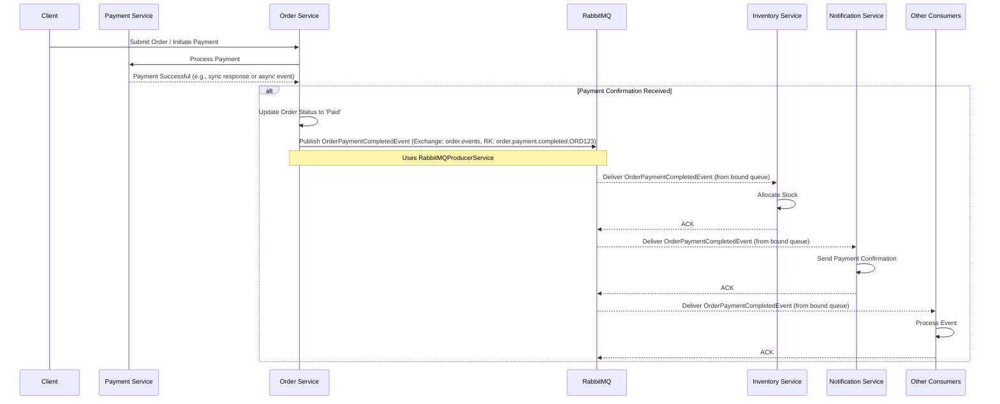

# OrderPaymentCompletedEvent

## 1. Overview

The `OrderPaymentCompletedEvent` is published by the Order Service when payment for an order has been successfully processed and confirmed by the Payment Service. This event signals that the order has transitioned from a pending payment state to a paid state, making it ready for subsequent processing steps like inventory allocation and fulfillment initiation.

This event is crucial for decoupling services and enabling an event-driven workflow. Downstream services listen for this event to trigger their respective responsibilities in the order lifecycle.

## 2. Event Details

*   **Message Type**: `OrderPaymentCompletedEvent`
*   **Source Service**: `order-service`
*   **Published by**: Order Service
*   **Consumed by**:
    *   Inventory Service (to allocate stock)
    *   Notification Service (to send payment confirmation)
    *   Fulfillment Service (to initiate shipping process)
    *   Analytics Service (for tracking and reporting)
    *   User Service (to update purchase history, loyalty points)

## 3. Event Schema

The `OrderPaymentCompletedEvent` follows the `StandardMessage<T>` envelope defined in the `@ecommerce-platform/rabbitmq-event-utils` library.

### 3.1. StandardMessage Envelope

```json
{
  "messageId": "string", // UUID v4, unique identifier for this specific message
  "messageType": "OrderPaymentCompletedEvent", // Type of the message
  "timestamp": "string", // ISO-8601 UTC timestamp
  "source": "order-service", // Service that originated the event
  "partitionKey": "string", // Typically the orderId for partitioning/routing
  "correlationId": "string", // Optional: for tracing a request through multiple services
  "payload": {
    // See OrderPaymentCompletedEventPayload schema below
  },
  "version": "1.0" // Version of the payload schema
}
```

### 3.2. OrderPaymentCompletedEventPayload Schema

```json
{
  "orderId": "string", // UUID v4, Order identifier
  "orderNumber": "string", // Human-readable order number
  "userId": "string", // UUID v4, User identifier
  "paymentId": "string", // UUID v4, Payment identifier from Payment Service
  "paymentTimestamp": "string", // ISO-8601 UTC, Timestamp of when payment was completed
  "totalAmount": "number", // Total order amount that was paid
  "currency": "string", // Three-letter currency code (e.g., "USD")
  "paymentMethodDetails": { // Details about the payment method used
    "methodType": "string", // e.g., "CREDIT_CARD", "PAYPAL", "BANK_TRANSFER"
    "cardLastFour": "string", // Optional: Last four digits of credit card
    "cardBrand": "string" // Optional: e.g., "VISA", "MASTERCARD"
    // Other relevant non-sensitive payment method details
  },
  "items": [
    {
      "productId": "string", // UUID v4, Product identifier
      "variantId": "string", // Optional UUID v4, Product variant identifier
      "productName": "string", // Name of the product
      "quantity": "integer", // Quantity ordered
      "unitPrice": "number", // Price per unit at the time of order
      "totalPrice": "number" // Total price for this item (quantity * unitPrice)
    }
  ],
  "shippingAddress": {
    "recipientName": "string",
    "addressLine1": "string",
    "addressLine2": "string", // Optional
    "city": "string",
    "stateOrProvince": "string",
    "postalCode": "string",
    "countryCode": "string" // Two-letter ISO country code
  },
  "billingAddress": { // Optional, if different from shipping
    "recipientName": "string",
    "addressLine1": "string",
    "addressLine2": "string", // Optional
    "city": "string",
    "stateOrProvince": "string",
    "postalCode": "string",
    "countryCode": "string" // Two-letter ISO country code
  },
  "customerNotes": "string" // Optional: Any notes provided by the customer
}
```

**Key Payload Fields:**

*   `orderId`: The unique identifier of the order. Used as the `partitionKey` in the `StandardMessage` envelope for routing.
*   `paymentId`: The identifier of the payment transaction from the Payment Service.
*   `paymentTimestamp`: When the payment was confirmed.
*   `totalAmount`, `currency`: The financial details of the payment.
*   `paymentMethodDetails`: Non-sensitive information about the payment method.
*   `items`: A list of items included in the order that are now paid for.
*   `shippingAddress`: Where the order should be shipped.

## 4. Event Publishing Logic

The Order Service publishes the `OrderPaymentCompletedEvent` after it receives confirmation from the Payment Service (e.g., via a `PaymentProcessedEvent` or a synchronous API call response) that payment for an order has been successfully completed.

### 4.1. Triggering Scenarios

*   Successful processing of a `PaymentProcessedEvent` (or similar) consumed from the Payment Service.
*   Successful synchronous confirmation from the Payment Service API during an order checkout flow.
*   Manual update of an order's payment status to 'Completed' by an administrator, if such an operation triggers the event.

### 4.2. Example Publishing Code (using `@ecommerce-platform/rabbitmq-event-utils`)

```typescript
import { Injectable, Logger } from '@nestjs/common';
import { RabbitMQProducerService, StandardMessage } from '@ecommerce-platform/rabbitmq-event-utils';
import { Order } from '../entities/order.entity'; // Hypothetical Order entity
import { PaymentConfirmation } from '../interfaces/payment-confirmation.interface'; // Hypothetical Payment details
import { v4 as uuidv4 } from 'uuid';
import { OrderPaymentCompletedEventPayload } from './payloads/order-payment-completed.payload'; // Defined based on schema

@Injectable()
export class OrderEventPublisher {
  private readonly logger = new Logger(OrderEventPublisher.name);
  private readonly exchangeName = 'order.events'; // Example exchange

  constructor(private readonly producerService: RabbitMQProducerService) {}

  async publishOrderPaymentCompleted(
    order: Order,
    paymentConfirmation: PaymentConfirmation,
  ): Promise<void> {
    const payload: OrderPaymentCompletedEventPayload = {
      orderId: order.id,
      orderNumber: order.orderNumber,
      userId: order.userId,
      paymentId: paymentConfirmation.paymentId,
      paymentTimestamp: paymentConfirmation.paymentTimestamp,
      totalAmount: order.totalAmount,
      currency: order.currency,
      paymentMethodDetails: paymentConfirmation.paymentMethodDetails,
      items: order.items.map(item => ({
        productId: item.productId,
        variantId: item.variantId,
        productName: item.productName, // Assuming this is available
        quantity: item.quantity,
        unitPrice: item.unitPrice,
        totalPrice: item.quantity * item.unitPrice,
      })),
      shippingAddress: order.shippingAddress, // Assuming direct mapping
      billingAddress: order.billingAddress, // Assuming direct mapping
      customerNotes: order.customerNotes,
    };

    const message: StandardMessage<OrderPaymentCompletedEventPayload> = {
      messageId: uuidv4(),
      messageType: 'OrderPaymentCompletedEvent',
      timestamp: new Date().toISOString(),
      source: 'order-service',
      partitionKey: order.id, // Use orderId for routing
      correlationId: order.correlationId || uuidv4(), // Or a specific correlation ID if available
      payload,
      version: '1.0',
    };

    try {
      // The routing key determines which queues bound to the exchange receive the message.
      // Example: "order.payment.completed"
      const routingKey = `order.payment.completed.${order.id}`;
      await this.producerService.publish(this.exchangeName, routingKey, message);
      this.logger.log(`Published OrderPaymentCompletedEvent for order ${order.id} with messageId ${message.messageId}`);
    } catch (error) {
      this.logger.error(
        `Failed to publish OrderPaymentCompletedEvent for order ${order.id}: ${error.message}`,
        error.stack,
      );
      // Implement retry logic or dead-lettering strategy as per
      // ecommerce-documentation/implementation-specs/user-service/05-event-publishing/08-idempotency-error-handling-publishing.md
      throw error; // Re-throw for central error handling
    }
  }
}
```

### 4.3. Data Validation

Before publishing:
*   Ensure `orderId`, `userId`, `paymentId`, `totalAmount`, `currency` are present and valid.
*   Validate `items` array is not empty and items have necessary details.
*   Ensure `shippingAddress` is complete.

### 4.4. Error Handling & Idempotency (Publishing)

Refer to the guidelines in `ecommerce-documentation/implementation-specs/user-service/05-event-publishing/08-idempotency-error-handling-publishing.md`. Key aspects include:
*   **Publisher Confirms**: Ensure RabbitMQ acknowledges receipt of the message.
*   **Outbox Pattern**: For atomicity between database state changes and event publishing.
*   **Retry Mechanisms**: For transient publishing failures.
*   **Dead Letter Exchanges (DLX)**: For messages that repeatedly fail to publish.

## 5. Event Consumption

### 5.1. Consumer Responsibilities

Services consuming `OrderPaymentCompletedEvent` must:
1.  **Idempotency**: Ensure the event is processed exactly once, even if received multiple times. This can be achieved by tracking processed `messageId`s.
2.  **Error Handling**: Implement robust error handling, including retries for transient issues and moving messages to a Dead Letter Queue (DLQ) for unrecoverable errors.
3.  **Schema Validation**: Validate the incoming event against the expected `StandardMessage<OrderPaymentCompletedEventPayload>` schema and version.
4.  **Timely Processing**: Process events promptly to avoid delays in downstream workflows.

### 5.2. Example Consumer Logic (Conceptual)

```typescript
// Conceptual example for Inventory Service using @ecommerce-platform/rabbitmq-event-utils
import { Injectable, Logger } from '@nestjs/common';
import { RabbitMQConsumer, StandardMessage, Nack } from '@ecommerce-platform/rabbitmq-event-utils';
import { OrderPaymentCompletedEventPayload } from './payloads/order-payment-completed.payload'; // Shared payload definition
import { InventoryService } from '../inventory.service'; // Actual inventory service

@Injectable()
export class OrderPaymentCompletedConsumer {
  private readonly logger = new Logger(OrderPaymentCompletedConsumer.name);

  constructor(
    private readonly rabbitMQConsumer: RabbitMQConsumer,
    private readonly inventoryService: InventoryService,
    // private readonly idempotencyService: IdempotencyService, // For tracking processed messages
  ) {
    // Subscription to the relevant queue and binding key would be configured
    // in the RabbitMQConsumer module setup or via decorators.
    // Example: queue 'inventory.order.payment.completed', binding key 'order.payment.completed.*'
  }

  // This method would be invoked by the RabbitMQConsumer utility upon message arrival
  async handleOrderPaymentCompleted(message: StandardMessage<OrderPaymentCompletedEventPayload>): Promise<void | Nack> {
    const { messageId, payload, partitionKey: orderId } = message;
    this.logger.log(`Received OrderPaymentCompletedEvent for order ${orderId}, messageId: ${messageId}`);

    // 1. Idempotency Check (pseudo-code)
    // if (await this.idempotencyService.isProcessed(messageId)) {
    //   this.logger.log(`Event ${messageId} already processed. Acknowledging.`);
    //   return; // Acknowledge without processing
    // }

    try {
      // 2. Business Logic
      await this.inventoryService.allocateStockForOrder(payload.orderId, payload.items);
      this.logger.log(`Successfully processed OrderPaymentCompletedEvent for order ${orderId}`);

      // 3. Mark as processed (pseudo-code)
      // await this.idempotencyService.markProcessed(messageId);

      // Message will be auto-acknowledged if no error is thrown or Nack returned
    } catch (error) {
      this.logger.error(
        `Error processing OrderPaymentCompletedEvent for order ${orderId}, messageId ${messageId}: ${error.message}`,
        error.stack,
      );
      // For retriable errors, return a Nack with requeue: true
      // For non-retriable errors, return Nack with requeue: false (goes to DLQ if configured)
      // This decision depends on the nature of the error.
      if (error.isTransient) { // Hypothetical property
        return new Nack(true); // Requeue
      }
      return new Nack(false); // Do not requeue (send to DLQ)
    }
  }
}
```

## 6. Sequence Diagram (RabbitMQ)



## 7. Security Considerations

*   **Transport Encryption**: All communication with RabbitMQ (Amazon MQ) must use TLS/SSL.
*   **Authentication & Authorization**:
    *   Order Service requires valid credentials to connect and publish to RabbitMQ.
    *   Consumers require valid credentials to connect and subscribe to queues.
    *   Utilize RabbitMQ virtual hosts and user permissions to enforce least privilege access for publishers and consumers.
*   **Payload Sensitivity**: The `OrderPaymentCompletedEventPayload` contains PII (shipping address, user ID). Ensure:
    *   Compliance with data privacy regulations (e.g., GDPR, CCPA).
    *   Access to event data is restricted to authorized services and personnel.
    *   Consider field-level encryption for highly sensitive parts of the payload if necessary, though generally avoided for event payloads if possible.
*   **Message Integrity**: While TLS provides integrity in transit, consider application-level signatures if end-to-end non-repudiation is critical (usually an overkill for internal events).
*   **Audit Logging**: Log event publishing and consumption attempts (successful or failed) for security auditing and troubleshooting.

## 8. Testing Strategy

### 8.1. Unit Tests (OrderEventPublisher)

*   Mock `RabbitMQProducerService`.
*   Verify that `publishOrderPaymentCompleted` constructs the `StandardMessage<OrderPaymentCompletedEventPayload>` correctly.
*   Verify it calls `producerService.publish` with the correct exchange, routing key, and message.
*   Test error handling when `producerService.publish` throws an error.

```typescript
// Example Snippet for Unit Test
import { Test, TestingModule } from '@nestjs/testing';
import { OrderEventPublisher } from './order-event.publisher';
import { RabbitMQProducerService } from '@ecommerce-platform/rabbitmq-event-utils';
import { ConfigService } from '@nestjs/config'; // If used for exchange names etc.
import { Logger } from '@nestjs/common';
// Mock Order and PaymentConfirmation data

describe('OrderEventPublisher', () => {
  let publisher: OrderEventPublisher;
  let mockProducerService: jest.Mocked<RabbitMQProducerService>;

  beforeEach(async () => {
    const module: TestingModule = await Test.createTestingModule({
      providers: [
        OrderEventPublisher,
        {
          provide: RabbitMQProducerService,
          useValue: {
            publish: jest.fn().mockResolvedValue(undefined),
          },
        },
        // Mock Logger if complex logging is tested
      ],
    }).compile();

    publisher = module.get<OrderEventPublisher>(OrderEventPublisher);
    mockProducerService = module.get(RabbitMQProducerService);
  });

  it('should publish OrderPaymentCompletedEvent with correct structure', async () => {
    const mockOrder = { id: 'order-123', /* ...other fields */ } as any;
    const mockPayment = { paymentId: 'pay-456', /* ...other fields */ } as any;
    
    await publisher.publishOrderPaymentCompleted(mockOrder, mockPayment);

    expect(mockProducerService.publish).toHaveBeenCalledTimes(1);
    const [exchange, routingKey, message] = mockProducerService.publish.mock.calls[0];
    
    expect(exchange).toBe('order.events'); // Or from config
    expect(routingKey).toContain('order.payment.completed.order-123');
    expect(message.messageType).toBe('OrderPaymentCompletedEvent');
    expect(message.source).toBe('order-service');
    expect(message.partitionKey).toBe(mockOrder.id);
    expect(message.payload.orderId).toBe(mockOrder.id);
    expect(message.payload.paymentId).toBe(mockPayment.paymentId);
    // ... more assertions on payload and envelope
  });
});
```

### 8.2. Integration Tests

*   **Publisher Side**:
    *   Use a test RabbitMQ instance (e.g., via Docker Testcontainers).
    *   Publish an event and use a test RabbitMQ client to assert the event arrives on the correct exchange/queue with the correct content.
*   **Consumer Side (e.g., for Inventory Service)**:
    *   Mock external dependencies of the consumer (e.g., database).
    *   Manually publish a test `OrderPaymentCompletedEvent` to the consumer's input queue.
    *   Verify the consumer's business logic is triggered correctly (e.g., `inventoryService.allocateStockForOrder` is called).
    *   Verify idempotency handling.
*   Utilize helpers from `@ecommerce-platform/testing-utils` like `MockRabbitMQProducerService` or factories for generating test messages.

## 9. References

*   `ecommerce-documentation/implementation-specs/shared-libraries/rabbitmq-event-utils/00-overview.md`
*   `ecommerce-documentation/implementation-specs/shared-libraries/rabbitmq-event-utils/01-standard-message-envelope.md`
*   `ecommerce-documentation/implementation-specs/user-service/05-event-publishing/08-idempotency-error-handling-publishing.md` (for publisher-side error handling)
*   `ecommerce-documentation/architecture/adr/ADR-018-message-broker-strategy.md`
*   Relevant Order Service data model files (e.g., for Order entity structure).
*   Payment Service integration documentation.
