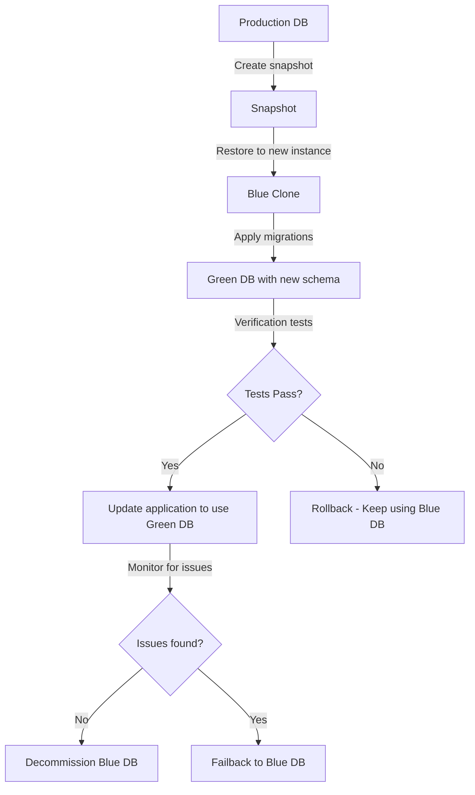

# Database Schema Migration for Product Service

## Overview

This document details the database schema migration strategy for the Product Service, focusing on AWS-centric approaches, workflow automation, and best practices for managing schema evolution in a microservices environment. This builds upon our existing [Migration Strategy](./04-migration-strategy.md) with specific focus on operational excellence in AWS.

## AWS-Centric Schema Migration Approach

### RDS Migration Considerations

- **Aurora PostgreSQL Compatibility**: Ensure migrations are compatible with Aurora PostgreSQL features and limitations
- **Multi-AZ Impact**: Coordinate migrations to minimize impact on failover capabilities
- **Read Replica Propagation**: Plan for propagation delay to read replicas

```typescript
// src/config/typeorm-migration.config.ts
import { ConfigService } from '@nestjs/config';
import { TypeOrmModuleOptions } from '@nestjs/typeorm';

export const getMigrationConfig = (configService: ConfigService): TypeOrmModuleOptions => ({
  ...getTypeOrmConfig(configService),
  migrationsTableName: 'migrations',
  migrations: [__dirname + '/../migrations/**/*{.ts,.js}'],
  migrationsRun: false, // Control migrations separately from application startup
  logging: true, // Always log migrations
  maxQueryExecutionTime: 10000, // Give extra time for migrations
});
```

### CloudWatch Monitoring Integration

```typescript
// src/migrations/monitoring/cloudwatch-integration.ts
import { CloudWatch } from 'aws-sdk';
import { MigrationInterface } from 'typeorm';
import { Logger } from '@nestjs/common';

export class MigrationCloudWatchMonitoring {
  private readonly logger = new Logger(MigrationCloudWatchMonitoring.name);
  private readonly cloudwatch: CloudWatch;
  
  constructor() {
    this.cloudwatch = new CloudWatch({
      region: process.env.AWS_REGION || 'us-east-1',
    });
  }
  
  async recordMigrationMetrics(migration: MigrationInterface, executionTimeMs: number, successful: boolean): Promise<void> {
    try {
      await this.cloudwatch.putMetricData({
        Namespace: 'ProductService/Migrations',
        MetricData: [
          {
            MetricName: 'MigrationExecutionTime',
            Dimensions: [
              {
                Name: 'MigrationName',
                Value: migration.name,
              },
              {
                Name: 'Environment',
                Value: process.env.NODE_ENV || 'development',
              },
            ],
            Value: executionTimeMs,
            Unit: 'Milliseconds',
          },
          {
            MetricName: 'MigrationSuccess',
            Dimensions: [
              {
                Name: 'MigrationName',
                Value: migration.name,
              },
              {
                Name: 'Environment',
                Value: process.env.NODE_ENV || 'development',
              },
            ],
            Value: successful ? 1 : 0,
            Unit: 'Count',
          },
        ],
      }).promise();
      
      this.logger.log(`Recorded migration metrics for ${migration.name}`);
    } catch (error) {
      this.logger.error(`Failed to record migration metrics: ${error.message}`, error.stack);
    }
  }
}
```

## CI/CD Integration

### CodePipeline Workflow for Migrations

```yaml
# migrations-pipeline.yml
AWSTemplateFormatVersion: '2010-09-09'
Resources:
  MigrationsPipeline:
    Type: AWS::CodePipeline::Pipeline
    Properties:
      RoleArn: !GetAtt MigrationsPipelineRole.Arn
      ArtifactStore:
        Type: S3
        Location: !Ref MigrationArtifactBucket
      Stages:
        - Name: Source
          Actions:
            - Name: Source
              ActionTypeId:
                Category: Source
                Owner: AWS
                Provider: CodeStarSourceConnection
                Version: '1'
              Configuration:
                ConnectionArn: !Ref GitHubConnection
                FullRepositoryId: "organization/product-service"
                BranchName: "main"
                OutputArtifactFormat: "CODE_ZIP"
              OutputArtifacts:
                - Name: SourceCode
        
        - Name: ValidateMigrations
          Actions:
            - Name: ValidateMigrationDryRun
              ActionTypeId:
                Category: Build
                Owner: AWS
                Provider: CodeBuild
                Version: '1'
              Configuration:
                ProjectName: !Ref MigrationValidationProject
              InputArtifacts:
                - Name: SourceCode
        
        - Name: DeployToStaging
          Actions:
            - Name: ApplyMigrationsStaging
              ActionTypeId:
                Category: Build
                Owner: AWS
                Provider: CodeBuild
                Version: '1'
              Configuration:
                ProjectName: !Ref MigrationStagingProject
              InputArtifacts:
                - Name: SourceCode
        
        - Name: ApproveProductionMigration
          Actions:
            - Name: ManualApproval
              ActionTypeId:
                Category: Approval
                Owner: AWS
                Provider: Manual
                Version: '1'
              Configuration:
                CustomData: "Approve database migrations for production"
        
        - Name: DeployToProduction
          Actions:
            - Name: ApplyMigrationsProduction
              ActionTypeId:
                Category: Build
                Owner: AWS
                Provider: CodeBuild
                Version: '1'
              Configuration:
                ProjectName: !Ref MigrationProductionProject
              InputArtifacts:
                - Name: SourceCode
```

### CodeBuild Specification

```yaml
# migration-buildspec.yml
version: 0.2

phases:
  install:
    runtime-versions:
      nodejs: 18
    commands:
      - npm install -g typescript ts-node
      - npm ci
  
  pre_build:
    commands:
      - echo "Retrieving database credentials from Secrets Manager"
      - export DB_CREDENTIALS=$(aws secretsmanager get-secret-value --secret-id ${DB_SECRET_ARN} --query SecretString --output text)
      - export DB_HOST=$(echo $DB_CREDENTIALS | jq -r '.host')
      - export DB_PORT=$(echo $DB_CREDENTIALS | jq -r '.port')
      - export DB_USERNAME=$(echo $DB_CREDENTIALS | jq -r '.username')
      - export DB_PASSWORD=$(echo $DB_CREDENTIALS | jq -r '.password')
      - export DB_DATABASE=$(echo $DB_CREDENTIALS | jq -r '.dbname')
      - export DB_SSL=true
  
  build:
    commands:
      - echo "Creating database snapshot before migration"
      - SNAPSHOT_ID=$(aws rds create-db-snapshot --db-instance-identifier ${DB_INSTANCE_ID} --db-snapshot-identifier "pre-migration-$(date +%Y%m%d%H%M%S)" --query DBSnapshot.DBSnapshotIdentifier --output text)
      - echo "Waiting for snapshot $SNAPSHOT_ID to complete..."
      - aws rds wait db-snapshot-completed --db-snapshot-identifier $SNAPSHOT_ID
      - echo "Snapshot created successfully, proceeding with migration"
      - echo "Running migrations..."
      - npm run typeorm -- migration:run -d src/config/typeorm-migration.config.ts
  
  post_build:
    commands:
      - if [ $CODEBUILD_BUILD_SUCCEEDING -eq 1 ]; then
          echo "Migration completed successfully!";
          aws sns publish --topic-arn ${NOTIFICATION_TOPIC_ARN} --subject "Database Migration Success" --message "Migration to ${DB_INSTANCE_ID} completed successfully at $(date)";
        else
          echo "Migration failed, sending notification for manual intervention";
          aws sns publish --topic-arn ${NOTIFICATION_TOPIC_ARN} --subject "URGENT: Database Migration Failed" --message "Migration to ${DB_INSTANCE_ID} failed at $(date). Manual intervention required. Snapshot $SNAPSHOT_ID is available for restoration.";
        fi

artifacts:
  files:
    - migration-report.json
  discard-paths: yes
```

## Blue-Green Deployment Strategy for Schema Changes

For high-risk migrations, consider a blue-green deployment approach:



### Blue-Green Deployment Script

```typescript
// src/scripts/blue-green-migration.ts
import { exec } from 'child_process';
import * as AWS from 'aws-sdk';
import { promisify } from 'util';

const execAsync = promisify(exec);
const rds = new AWS.RDS();
const ssm = new AWS.SSM();

async function performBlueGreenMigration() {
  try {
    // 1. Identify current (blue) database
    const blueDbInstance = process.env.CURRENT_DB_INSTANCE;
    const blueEndpoint = await getEndpoint(blueDbInstance);
    
    // 2. Create snapshot of blue database
    const snapshotName = `${blueDbInstance}-snapshot-${Date.now()}`;
    console.log(`Creating snapshot ${snapshotName} from ${blueDbInstance}...`);
    await rds.createDBSnapshot({
      DBInstanceIdentifier: blueDbInstance,
      DBSnapshotIdentifier: snapshotName
    }).promise();
    
    // 3. Wait for snapshot to complete
    console.log('Waiting for snapshot to complete...');
    await rds.waitFor('dbSnapshotAvailable', {
      DBSnapshotIdentifier: snapshotName
    }).promise();
    
    // 4. Create green database from snapshot
    const greenDbInstance = `${blueDbInstance}-green`;
    console.log(`Creating green instance ${greenDbInstance} from snapshot...`);
    await rds.restoreDBInstanceFromDBSnapshot({
      DBInstanceIdentifier: greenDbInstance,
      DBSnapshotIdentifier: snapshotName,
      DBSubnetGroupName: process.env.DB_SUBNET_GROUP,
      PubliclyAccessible: false,
    }).promise();
    
    // 5. Wait for green instance to be available
    console.log('Waiting for green instance to be available...');
    await rds.waitFor('dbInstanceAvailable', {
      DBInstanceIdentifier: greenDbInstance
    }).promise();
    
    // 6. Apply migrations to green database
    const greenEndpoint = await getEndpoint(greenDbInstance);
    console.log(`Applying migrations to green database at ${greenEndpoint}...`);
    await execAsync(`DB_HOST=${greenEndpoint} npm run typeorm migration:run`);
    
    // 7. Run verification tests against green database
    console.log('Running verification tests against green database...');
    await execAsync(`DB_HOST=${greenEndpoint} npm run test:migrations`);
    
    // 8. Update parameter store to point to green database
    console.log('Updating application to use green database...');
    await ssm.putParameter({
      Name: '/product-service/database/endpoint',
      Value: greenEndpoint,
      Type: 'String',
      Overwrite: true
    }).promise();
    
    // 9. Decommission blue database (or keep as fallback)
    console.log('Migration complete! Green database is now active.');
    console.log(`Blue database (${blueEndpoint}) can be decommissioned after verification period.`);
    
  } catch (error) {
    console.error('Blue-Green migration failed:', error);
    process.exit(1);
  }
}

async function getEndpoint(dbInstanceId) {
  const result = await rds.describeDBInstances({
    DBInstanceIdentifier: dbInstanceId
  }).promise();
  return result.DBInstances[0].Endpoint.Address;
}

performBlueGreenMigration().catch(console.error);
```

## Schema Versioning Strategy

### Migration Version Control

```typescript
// src/migrations/migration-metadata.ts
import { MigrationInterface } from 'typeorm';

export interface MigrationMetadata {
  version: string;  // Semantic version X.Y.Z
  description: string;
  author: string;
  date: Date;
  requiresDowntime: boolean;
  estimatedDuration: number; // in seconds
  impactedTables: string[];
  isBreaking: boolean;  // Could break existing queries/code
  dependsOn?: string[]; // Dependencies on other migrations
}

export function registerMigrationMetadata(
  migration: MigrationInterface,
  metadata: MigrationMetadata
): void {
  (migration as any).metadata = metadata;
}

// Example usage
registerMigrationMetadata(AddProductAttributes1709123456789, {
  version: '1.2.0',
  description: 'Add attributes column to product_variants table',
  author: 'Developer Name',
  date: new Date('2024-06-25'),
  requiresDowntime: false,
  estimatedDuration: 120,
  impactedTables: ['product_variants'],
  isBreaking: false
});
```

## Data Migration and Validation

### Data Migration Wrapper with Validation

```typescript
// src/migrations/utils/safe-data-migration.ts
import { QueryRunner } from 'typeorm';
import { Logger } from '@nestjs/common';

export interface DataValidation {
  name: string;
  query: string;
  expectedResult: any;
  compareFunc?: (actual: any, expected: any) => boolean;
}

export async function safeDataMigration(
  queryRunner: QueryRunner,
  migrationName: string,
  migrationQuery: string,
  validations: DataValidation[],
  batchSize: number = 1000
): Promise<void> {
  const logger = new Logger(`DataMigration:${migrationName}`);
  
  // Start transaction
  await queryRunner.startTransaction();
  
  try {
    logger.log(`Starting data migration: ${migrationName}`);
    
    // Execute migration in batches if needed
    if (batchSize > 0) {
      logger.log(`Executing with batch size: ${batchSize}`);
      await executeBatchedMigration(queryRunner, migrationQuery, batchSize);
    } else {
      await queryRunner.query(migrationQuery);
    }
    
    // Run validations
    for (const validation of validations) {
      logger.log(`Running validation: ${validation.name}`);
      const result = await queryRunner.query(validation.query);
      
      // Check results
      const compareFunction = validation.compareFunc || defaultCompare;
      if (!compareFunction(result, validation.expectedResult)) {
        throw new Error(
          `Validation "${validation.name}" failed. ` +
          `Expected: ${JSON.stringify(validation.expectedResult)}, ` +
          `Got: ${JSON.stringify(result)}`
        );
      }
      logger.log(`Validation ${validation.name} passed`);
    }
    
    // Commit if all validations pass
    await queryRunner.commitTransaction();
    logger.log(`Data migration ${migrationName} completed successfully`);
    
  } catch (error) {
    logger.error(`Data migration failed: ${error.message}`, error.stack);
    await queryRunner.rollbackTransaction();
    throw error;
  }
}

async function executeBatchedMigration(
  queryRunner: QueryRunner,
  query: string,
  batchSize: number
): Promise<void> {
  // Implement batching logic for large data migrations
  // This helps avoid long-running transactions and lock contention
}

function defaultCompare(actual: any, expected: any): boolean {
  if (Array.isArray(actual) && actual.length === 1) {
    return JSON.stringify(actual[0]) === JSON.stringify(expected);
  }
  return JSON.stringify(actual) === JSON.stringify(expected);
}

// Example usage
export class ProductDataMigration1709123456789 implements MigrationInterface {
  public async up(queryRunner: QueryRunner): Promise<void> {
    await safeDataMigration(
      queryRunner,
      'Normalize Product Names',
      `
        UPDATE products
        SET name = TRIM(REGEXP_REPLACE(name, '\\s+', ' ', 'g'))
        WHERE name LIKE '%  %'
      `,
      [
        {
          name: 'No multiple spaces should exist',
          query: `SELECT COUNT(*) FROM products WHERE name LIKE '%  %'`,
          expectedResult: { count: '0' }
        },
        {
          name: 'All names should be trimmed',
          query: `SELECT COUNT(*) FROM products WHERE LENGTH(name) != LENGTH(TRIM(name))`,
          expectedResult: { count: '0' }
        }
      ]
    );
  }

  public async down(queryRunner: QueryRunner): Promise<void> {
    // Down migrations for data changes are typically not implemented
    // as they could lead to data loss
  }
}
```

## Database Schema Documentation Generation

### Automated Schema Documentation

```typescript
// src/scripts/generate-schema-docs.ts
import { DataSource } from 'typeorm';
import * as fs from 'fs';
import * as path from 'path';
import { getTypeOrmConfig } from '../config/typeorm.config';
import { ConfigService } from '@nestjs/config';

async function generateSchemaDocs() {
  const configService = new ConfigService();
  const dataSource = new DataSource(getTypeOrmConfig(configService));
  await dataSource.initialize();
  
  try {
    const tables = await dataSource.query(`
      SELECT 
        table_name,
        table_schema,
        obj_description((table_schema || '.' || table_name)::regclass, 'pg_class') as table_description
      FROM information_schema.tables
      WHERE table_schema = 'public'
        AND table_type = 'BASE TABLE'
      ORDER BY table_name
    `);
    
    let markdown = '# Product Service Database Schema\n\n';
    markdown += 'This document is automatically generated based on the current database schema.\n\n';
    markdown += `Last updated: ${new Date().toISOString()}\n\n`;
    
    for (const table of tables) {
      markdown += `## ${table.table_name}\n\n`;
      
      if (table.table_description) {
        markdown += `${table.table_description}\n\n`;
      }
      
      const columns = await dataSource.query(`
        SELECT 
          column_name,
          data_type,
          character_maximum_length,
          column_default,
          is_nullable,
          col_description((table_schema || '.' || table_name)::regclass, ordinal_position) as column_description
        FROM information_schema.columns
        WHERE table_schema = '${table.table_schema}'
          AND table_name = '${table.table_name}'
        ORDER BY ordinal_position
      `);
      
      markdown += '| Column | Type | Nullable | Default | Description |\n';
      markdown += '| ------ | ---- | -------- | ------- | ----------- |\n';
      
      for (const column of columns) {
        let dataType = column.data_type;
        if (column.character_maximum_length) {
          dataType += `(${column.character_maximum_length})`;
        }
        
        markdown += `| ${column.column_name} | ${dataType} | ${column.is_nullable} | ${column.column_default || ''} | ${column.column_description || ''} |\n`;
      }
      
      markdown += '\n';
      
      // Add indexes
      const indexes = await dataSource.query(`
        SELECT
          i.relname as index_name,
          a.attname as column_name,
          ix.indisunique as is_unique,
          ix.indisprimary as is_primary
        FROM
          pg_class t,
          pg_class i,
          pg_index ix,
          pg_attribute a
        WHERE
          t.oid = ix.indrelid
          AND i.oid = ix.indexrelid
          AND a.attrelid = t.oid
          AND a.attnum = ANY(ix.indkey)
          AND t.relkind = 'r'
          AND t.relname = '${table.table_name}'
        ORDER BY
          i.relname, a.attnum
      `);
      
      if (indexes.length > 0) {
        markdown += '### Indexes\n\n';
        markdown += '| Name | Columns | Type |\n';
        markdown += '| ---- | ------- | ---- |\n';
        
        const indexMap = {};
        for (const index of indexes) {
          if (!indexMap[index.index_name]) {
            indexMap[index.index_name] = {
              name: index.index_name,
              columns: [],
              type: index.is_primary ? 'PRIMARY KEY' : (index.is_unique ? 'UNIQUE' : 'INDEX')
            };
          }
          indexMap[index.index_name].columns.push(index.column_name);
        }
        
        for (const indexName in indexMap) {
          const index = indexMap[indexName];
          markdown += `| ${index.name} | ${index.columns.join(', ')} | ${index.type} |\n`;
        }
        
        markdown += '\n';
      }
      
      // Add foreign keys
      const foreignKeys = await dataSource.query(`
        SELECT
          tc.constraint_name,
          kcu.column_name,
          ccu.table_name AS foreign_table_name,
          ccu.column_name AS foreign_column_name
        FROM
          information_schema.table_constraints AS tc
          JOIN information_schema.key_column_usage AS kcu
            ON tc.constraint_name = kcu.constraint_name
            AND tc.table_schema = kcu.table_schema
          JOIN information_schema.constraint_column_usage AS ccu
            ON ccu.constraint_name = tc.constraint_name
            AND ccu.table_schema = tc.table_schema
        WHERE tc.constraint_type = 'FOREIGN KEY'
          AND tc.table_name='${table.table_name}'
      `);
      
      if (foreignKeys.length > 0) {
        markdown += '### Foreign Keys\n\n';
        markdown += '| Column | References |\n';
        markdown += '| ------ | ---------- |\n';
        
        for (const fk of foreignKeys) {
          markdown += `| ${fk.column_name} | ${fk.foreign_table_name}(${fk.foreign_column_name}) |\n`;
        }
        
        markdown += '\n';
      }
    }
    
    const docsDir = path.join(__dirname, '../../docs/schema');
    if (!fs.existsSync(docsDir)) {
      fs.mkdirSync(docsDir, { recursive: true });
    }
    
    fs.writeFileSync(path.join(docsDir, 'database-schema.md'), markdown);
    console.log('Schema documentation generated successfully!');
    
  } catch (error) {
    console.error('Error generating schema documentation:', error);
  } finally {
    await dataSource.destroy();
  }
}

generateSchemaDocs().catch(console.error);
```

## AWS Database Migration Service Integration

For complex migrations between major PostgreSQL versions or to different database engines:

```typescript
// src/scripts/dms-migration.ts
import * as AWS from 'aws-sdk';

const dms = new AWS.DatabaseMigrationService();

async function setupDmsMigration() {
  // 1. Create replication instance
  const replicationInstance = await dms.createReplicationInstance({
    ReplicationInstanceIdentifier: 'product-service-migration',
    ReplicationInstanceClass: 'dms.t3.medium',
    AllocatedStorage: 50,
    VpcSecurityGroupIds: [process.env.SECURITY_GROUP_ID],
    AvailabilityZone: process.env.AVAILABILITY_ZONE,
    ReplicationSubnetGroupIdentifier: process.env.SUBNET_GROUP_ID,
    MultiAZ: false,
    EngineVersion: '3.4.6',
    PubliclyAccessible: false,
    Tags: [
      {
        Key: 'Service',
        Value: 'ProductService'
      }
    ]
  }).promise();
  
  // 2. Wait for replication instance to be available
  await dms.waitFor('replicationInstanceAvailable', {
    ReplicationInstanceArn: replicationInstance.ReplicationInstance.ReplicationInstanceArn
  }).promise();
  
  // 3. Create source endpoint
  const sourceEndpoint = await dms.createEndpoint({
    EndpointIdentifier: 'product-service-source',
    EndpointType: 'source',
    EngineName: 'postgres',
    ServerName: process.env.SOURCE_DB_HOST,
    Port: parseInt(process.env.SOURCE_DB_PORT || '5432'),
    DatabaseName: process.env.SOURCE_DB_NAME,
    Username: process.env.SOURCE_DB_USERNAME,
    Password: process.env.SOURCE_DB_PASSWORD,
    SslMode: 'require'
  }).promise();
  
  // 4. Create target endpoint
  const targetEndpoint = await dms.createEndpoint({
    EndpointIdentifier: 'product-service-target',
    EndpointType: 'target',
    EngineName: 'postgres',
    ServerName: process.env.TARGET_DB_HOST,
    Port: parseInt(process.env.TARGET_DB_PORT || '5432'),
    DatabaseName: process.env.TARGET_DB_NAME,
    Username: process.env.TARGET_DB_USERNAME,
    Password: process.env.TARGET_DB_PASSWORD,
    SslMode: 'require'
  }).promise();
  
  // 5. Create replication task
  const replicationTask = await dms.createReplicationTask({
    ReplicationTaskIdentifier: 'product-service-migration-task',
    SourceEndpointArn: sourceEndpoint.Endpoint.EndpointArn,
    TargetEndpointArn: targetEndpoint.Endpoint.EndpointArn,
    ReplicationInstanceArn: replicationInstance.ReplicationInstance.ReplicationInstanceArn,
    MigrationType: 'full-load-and-cdc',
    TableMappings: JSON.stringify({
      rules: [
        {
          rule-type: 'selection',
          rule-id: '1',
          rule-name: 'product-tables',
          object-locator: {
            schema-name: 'public',
            table-name: '%'
          },
          rule-action: 'include'
        }
      ]
    }),
    ReplicationTaskSettings: JSON.stringify({
      TargetMetadata: {
        BatchApplyEnabled: true,
        FullLobMode: false
      },
      FullLoadSettings: {
        TargetTablePrepMode: 'DO_NOTHING',
        CreatePkAfterFullLoad: false,
        StopTaskCachedChangesApplied: false,
        StopTaskCachedChangesNotApplied: false,
        MaxFullLoadSubTasks: 8,
        TransactionConsistencyTimeout: 600,
        CommitRate: 10000
      },
      Logging: {
        EnableLogging: true
      }
    })
  }).promise();
  
  console.log('DMS migration setup completed successfully!');
  console.log('Replication Task ARN:', replicationTask.ReplicationTask.ReplicationTaskArn);
}

setupDmsMigration().catch(console.error);
```

## Disaster Recovery Plan for Failed Migrations

### Automated Restoration Script

```typescript
// src/scripts/migration-restore.ts
import * as AWS from 'aws-sdk';
import { Logger } from '@nestjs/common';

const rds = new AWS.RDS();
const logger = new Logger('MigrationRestore');

async function restoreFromPreMigrationSnapshot(
  dbInstanceIdentifier: string,
  snapshotIdentifier: string,
  dbParameterGroupName: string,
  dbSecurityGroupIds: string[],
  dbSubnetGroupName: string
): Promise<void> {
  try {
    logger.log(`Starting restoration from snapshot ${snapshotIdentifier} to ${dbInstanceIdentifier}`);
    
    // 1. First check if instance exists and needs to be deleted
    try {
      await rds.describeDBInstances({
        DBInstanceIdentifier: dbInstanceIdentifier
      }).promise();
      
      // Instance exists - need to delete it first
      logger.log(`Instance ${dbInstanceIdentifier} exists, deleting it first...`);
      await rds.deleteDBInstance({
        DBInstanceIdentifier: dbInstanceIdentifier,
        SkipFinalSnapshot: true,
        DeleteAutomatedBackups: true
      }).promise();
      
      // Wait for deletion to complete
      logger.log(`Waiting for instance ${dbInstanceIdentifier} to be deleted...`);
      await rds.waitFor('dbInstanceDeleted', {
        DBInstanceIdentifier: dbInstanceIdentifier
      }).promise();
    } catch (error) {
      // If the error is that the instance does not exist, that's fine
      if (error.code !== 'DBInstanceNotFound') {
        throw error;
      }
    }
    
    // 2. Restore from snapshot
    logger.log(`Restoring ${dbInstanceIdentifier} from snapshot ${snapshotIdentifier}...`);
    await rds.restoreDBInstanceFromDBSnapshot({
      DBInstanceIdentifier: dbInstanceIdentifier,
      DBSnapshotIdentifier: snapshotIdentifier,
      DBParameterGroupName: dbParameterGroupName,
      VpcSecurityGroupIds: dbSecurityGroupIds,
      DBSubnetGroupName: dbSubnetGroupName,
      PubliclyAccessible: false,
      MultiAZ: true,
      AutoMinorVersionUpgrade: true,
      CopyTagsToSnapshot: true
    }).promise();
    
    // 3. Wait for instance to be available
    logger.log(`Waiting for restored instance ${dbInstanceIdentifier} to be available...`);
    await rds.waitFor('dbInstanceAvailable', {
      DBInstanceIdentifier: dbInstanceIdentifier
    }).promise();
    
    logger.log(`Restoration completed successfully for ${dbInstanceIdentifier}`);
    
  } catch (error) {
    logger.error(`Restoration failed: ${error.message}`, error.stack);
    throw error;
  }
}

// Example usage during CI/CD pipeline failure handling
async function handleFailedMigration(): Promise<void> {
  const dbInstanceIdentifier = process.env.DB_INSTANCE_ID;
  const snapshotPattern = `pre-migration-${dbInstanceIdentifier}-*`;
  
  try {
    // Find the most recent pre-migration snapshot
    const snapshots = await rds.describeDBSnapshots({
      DBInstanceIdentifier: dbInstanceIdentifier,
      SnapshotType: 'manual'
    }).promise();
    
    const preMigrationSnapshots = snapshots.DBSnapshots
      .filter(s => s.DBSnapshotIdentifier.startsWith(`pre-migration-${dbInstanceIdentifier}`))
      .sort((a, b) => b.SnapshotCreateTime.getTime() - a.SnapshotCreateTime.getTime());
    
    if (preMigrationSnapshots.length === 0) {
      throw new Error('No pre-migration snapshots found');
    }
    
    const latestSnapshot = preMigrationSnapshots[0];
    logger.log(`Found latest pre-migration snapshot: ${latestSnapshot.DBSnapshotIdentifier}`);
    
    // Get instance details to preserve configuration
    const instanceDetails = await rds.describeDBInstances({
      DBInstanceIdentifier: dbInstanceIdentifier
    }).promise();
    
    const instance = instanceDetails.DBInstances[0];
    
    // Restore from snapshot
    await restoreFromPreMigrationSnapshot(
      dbInstanceIdentifier,
      latestSnapshot.DBSnapshotIdentifier,
      instance.DBParameterGroups[0].DBParameterGroupName,
      instance.VpcSecurityGroups.map(sg => sg.VpcSecurityGroupId),
      instance.DBSubnetGroup.DBSubnetGroupName
    );
    
    // Send notification
    const sns = new AWS.SNS();
    await sns.publish({
      TopicArn: process.env.NOTIFICATION_TOPIC_ARN,
      Subject: 'Database Migration Rollback Completed',
      Message: `
        Database migration rollback for ${dbInstanceIdentifier} has been completed successfully.
        Restored from snapshot: ${latestSnapshot.DBSnapshotIdentifier}
        Restore time: ${new Date().toISOString()}
        
        Please investigate the failed migration and resolve issues before attempting again.
      `
    }).promise();
    
  } catch (error) {
    logger.error(`Failed to handle migration failure: ${error.message}`, error.stack);
    
    // Send failure notification
    const sns = new AWS.SNS();
    await sns.publish({
      TopicArn: process.env.NOTIFICATION_TOPIC_ARN,
      Subject: 'URGENT: Database Migration Rollback Failed',
      Message: `
        Database migration rollback for ${dbInstanceIdentifier} has FAILED.
        Error: ${error.message}
        
        MANUAL INTERVENTION REQUIRED IMMEDIATELY!
      `
    }).promise();
    
    throw error;
  }
}

// Export functions for use in CI/CD pipeline
export { restoreFromPreMigrationSnapshot, handleFailedMigration };
```

## Best Practices

### AWS-Specific Best Practices

1. **Leverage RDS Capabilities**
   - Use RDS snapshot backups before migrations
   - Consider Multi-AZ during migrations to minimize downtime
   - Utilize Performance Insights to monitor migration impact

2. **Security**
   - Store database credentials in AWS Secrets Manager
   - Rotate credentials after critical migrations
   - Restrict migration execution to specific IAM roles

3. **Monitoring**
   - Set up CloudWatch alarms for migration monitoring
   - Create custom metrics for migration execution
   - Use SNS for notifications of migration events

4. **Cost Management**
   - Schedule migrations during off-peak hours to minimize performance impact
   - Use spot instances for CI/CD migration testing where possible
   - Consider RDS Aurora Serverless for test migrations with variable workloads

5. **Compliance**
   - Maintain detailed migration logs in CloudWatch Logs
   - Document all schema changes in version control
   - Implement approval workflows for production migrations

### Migration Patterns to Avoid

1. **Large Batches**: Avoid migrating large amounts of data in a single transaction
2. **Unversioned Migrations**: Never deploy migrations without version control
3. **Untested Changes**: Always test migrations in lower environments first
4. **Direct Production Edits**: Never modify schema directly in production
5. **Mixing Schema and Data**: Separate schema migrations from data migrations when possible

## References

- [AWS Database Migration Service Documentation](https://docs.aws.amazon.com/dms/latest/userguide/Welcome.html)
- [TypeORM Migrations Documentation](https://typeorm.io/#/migrations)
- [AWS RDS Best Practices](https://docs.aws.amazon.com/AmazonRDS/latest/UserGuide/CHAP_BestPractices.html)
- [PostgreSQL Zero Downtime Migrations](https://medium.com/braintree-product-technology/postgresql-at-scale-database-schema-changes-without-downtime-20d3749ed680)
- [ADR-004: PostgreSQL for Relational Data](../../../architecture/adr/ADR-004-postgresql-for-relational-data.md)
- [AWS-Centric Technology Decisions: Relational Database - PostgreSQL](../../../architecture/technology-decisions-aws-centeric/05-relational-database-postgresql.md)