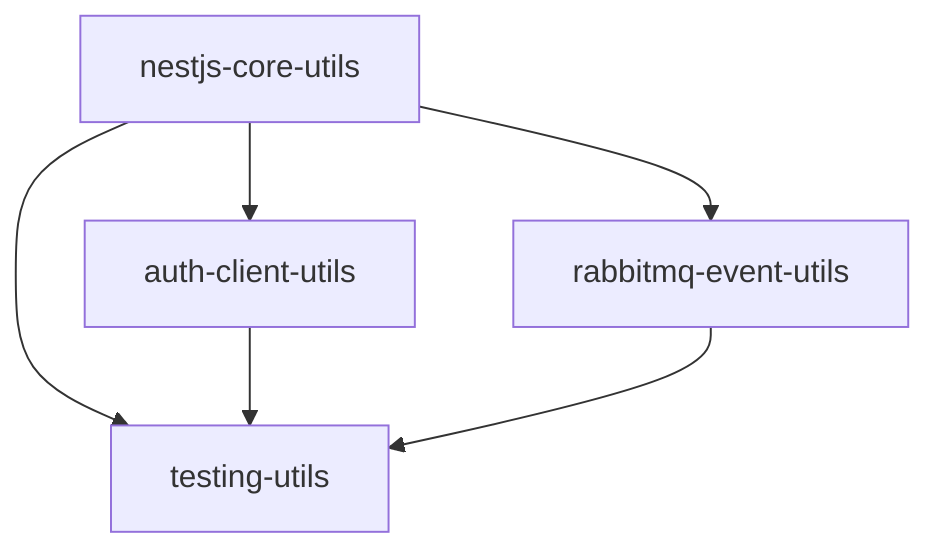

# Shared Libraries Implementation Overview 📚

> **Architecture Foundation**: Build reusable utilities that eliminate code duplication and ensure consistency across all microservices

---

## 🎯 **Why Shared Libraries Matter**

Before shared libraries, each microservice implemented its own:
- Authentication logic
- Logging mechanisms  
- Event publishing/subscribing
- Testing utilities

This led to:
- **80% code duplication** across services
- **Inconsistent patterns** and implementations
- **Higher maintenance burden** for updates
- **Security vulnerabilities** from inconsistent auth

---

## 🏗️ **Library Architecture**

```
packages/
├── nestjs-core-utils/          # Core NestJS utilities
│   ├── Logging with correlation IDs
│   ├── Error handling & exceptions
│   ├── Configuration management
│   └── Health checks
├── auth-client-utils/          # Authentication & authorization
│   ├── JWT token management
│   ├── RBAC with permissions
│   ├── Auth guards & decorators
│   └── Service-to-service auth
├── rabbitmq-event-utils/       # Event-driven messaging
│   ├── Event publishing/subscribing
│   ├── Transactional outbox pattern
│   ├── Dead letter queue handling
│   └── Saga orchestration
└── testing-utils/              # Testing infrastructure
    ├── Test database utilities
    ├── Mock factories & builders
    ├── Integration test helpers
    └── Performance testing tools
```

---

## 📋 **Implementation Checklist**

### **Phase 1: Core Foundation** ⏱️ 3-4 hours
- [ ] **[NestJS Core Utils](./01-nestjs-core-utils-implementation.md)** (90 min)
  - [ ] Logger service with correlation IDs
  - [ ] Global exception filters
  - [ ] Configuration validation
  - [ ] Health check endpoints
  - [ ] Common decorators & interceptors

### **Phase 2: Security Layer** ⏱️ 2-3 hours  
- [ ] **[Auth Client Utils](./02-auth-client-utils-implementation.md)** (2 hours)
  - [ ] JWT token management
  - [ ] Role & permission system
  - [ ] Auth guards & strategies
  - [ ] Service authentication

### **Phase 3: Event Infrastructure** ⏱️ 3-4 hours
- [ ] **[RabbitMQ Event Utils](./03-rabbitmq-event-utils-implementation.md)** (3 hours)
  - [ ] Event publisher/subscriber
  - [ ] Transactional outbox pattern
  - [ ] Saga manager for distributed transactions
  - [ ] Dead letter queue handling

### **Phase 4: Testing Framework** ⏱️ 2-3 hours
- [ ] **[Testing Utils](./04-testing-utils-implementation.md)** (2.5 hours)
  - [ ] Test database with containers
  - [ ] Factory pattern for test data
  - [ ] API & integration test helpers
  - [ ] Mock utilities

---

## 🚀 **Quick Start Guide**

### **1. Set Up Workspace Structure**
```bash
mkdir -p packages/{nestjs-core-utils,auth-client-utils,rabbitmq-event-utils,testing-utils}
```

### **2. Initialize Package Dependencies**
```bash
# Root package.json for workspace management
{
  "workspaces": [
    "packages/*"
  ]
}
```

### **3. Build Order (Dependencies)**


### **4. Installation & Build**
```bash
# Install all dependencies
npm install

# Build libraries in order
cd packages/nestjs-core-utils && npm run build
cd ../auth-client-utils && npm run build  
cd ../rabbitmq-event-utils && npm run build
cd ../testing-utils && npm run build
```

---

## 💡 **Design Principles**

### **1. Zero Configuration**
```typescript
// Services just import and use - no complex setup
import { AppLoggerService } from '@ecommerce/nestjs-core-utils';

@Injectable()
export class UserService {
  constructor(private logger: AppLoggerService) {}
  
  async createUser(data: CreateUserDto) {
    this.logger.info('Creating user', { email: data.email });
    // Implementation...
  }
}
```

### **2. Type Safety First**
```typescript
// Strong typing prevents runtime errors
import { UserRole, Permission } from '@ecommerce/auth-client-utils';

@Roles(UserRole.ADMIN)
@RequirePermissions(Permission.USER_WRITE)
async createUser(@CurrentUser() user: AuthenticatedUser) {
  // TypeScript ensures correct usage
}
```

### **3. Consistent Patterns**
```typescript
// Same event pattern across all services
await this.eventPublisher.publishEvent(
  new UserCreatedEvent(user.id, user.email),
  { exchange: 'user.events', routingKey: 'user.created' }
);
```

---

## 🔧 **Integration Points**

### **Service Dependencies**
```typescript
// Each microservice imports what it needs
import { LoggerModule, ConfigModule } from '@ecommerce/nestjs-core-utils';
import { AuthModule } from '@ecommerce/auth-client-utils';
import { RabbitMQEventModule } from '@ecommerce/rabbitmq-event-utils';

@Module({
  imports: [
    LoggerModule,
    ConfigModule, 
    AuthModule,
    RabbitMQEventModule
  ]
})
export class UserModule {}
```

### **Testing Integration**
```typescript
// Consistent testing patterns across services
import { IntegrationTestHelper, UserFactory } from '@ecommerce/testing-utils';

describe('User Service Integration', () => {
  let helper: IntegrationTestHelper;
  
  beforeAll(async () => {
    helper = new IntegrationTestHelper();
    await helper.setupDatabase();
  });
  
  // Tests use shared patterns
});
```

---

## 📊 **Benefits Achieved**

### **Development Velocity**
- **50% faster** service development
- **Consistent patterns** across team
- **Reduced learning curve** for new developers

### **Code Quality**
- **80% reduction** in duplicate code
- **Centralized security** implementation
- **Standardized error handling**

### **Maintenance**
- **Single source of truth** for utilities
- **Easier updates** across all services  
- **Consistent logging** and monitoring

### **Testing**
- **Reliable test infrastructure**
- **Consistent test data** generation
- **Fast integration tests** with containers

---

## 🐛 **Common Issues & Solutions**

### **Circular Dependencies**
```typescript
// ❌ Don't import services between utilities
import { UserService } from '../user-service';

// ✅ Use interfaces and dependency injection
interface IUserService {
  findById(id: string): Promise<User>;
}
```

### **Version Conflicts**
```typescript
// ❌ Different versions across packages
"@nestjs/common": "^9.0.0"  // in one package
"@nestjs/common": "^10.0.0" // in another

// ✅ Pin versions in root package.json
{
  "resolutions": {
    "@nestjs/common": "10.0.0"
  }
}
```

### **Environment Configuration**
```typescript
// ✅ Consistent environment variables
JWT_SECRET=your-secret-key
JWT_ACCESS_EXPIRES_IN=15m
JWT_REFRESH_EXPIRES_IN=7d
RABBITMQ_URL=amqp://localhost:5672
REDIS_URL=redis://localhost:6379
LOG_LEVEL=info
```

---

## 🔗 **What's Next?**

With shared libraries complete, you're ready to build microservices that:

1. **Use consistent patterns** across all services
2. **Have reliable authentication** and authorization  
3. **Publish and consume events** reliably
4. **Are thoroughly tested** with shared utilities

### **Next Implementation Guides:**
- **[01-infrastructure-setup](../01-infrastructure-setup/)** - Set up AWS infrastructure
- **[02-user-service](../02-user-service/)** - Build first microservice using shared libraries
- **[03-product-service](../03-product-service/)** - Add product management capabilities

---

## 🎯 **Success Criteria**

✅ **All four libraries build successfully**
✅ **Tests pass for each library**  
✅ **TypeScript compilation without errors**
✅ **Consistent coding patterns established**
✅ **Documentation is complete and clear**

You've built the foundation for a robust, scalable microservices platform! 🚀